# GOTN Architecture Overview

**Goal-Oriented Task Network** - A recursive orchestration framework for complex AI workflows.

---

## The Problem

When AI agents tackle complex goals, they face a fundamental challenge: **depth vs. context**.

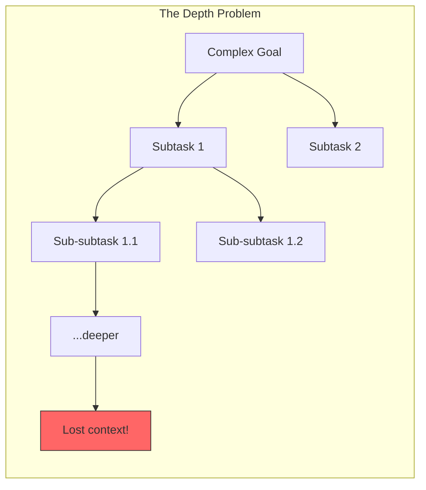

As tasks decompose deeper:
- **Context gets lost** - Deep subtasks forget the original objective
- **Goals drift** - Intermediate work diverges from what was actually needed
- **Confidence is uncertain** - No clear signal when "enough" research is done
- **Resources exhaust** - Unbounded exploration without delivery

**Real example**: Ask an AI to "build a children's story generator" and watch it:
1. Research TTS options endlessly
2. Evaluate 47 voice providers
3. Never actually build anything
4. Run out of context window mid-task

---

## The Solution: Self-Similar WorkNodes

GOTN solves this with a single, recursive abstraction: **the WorkNode**.

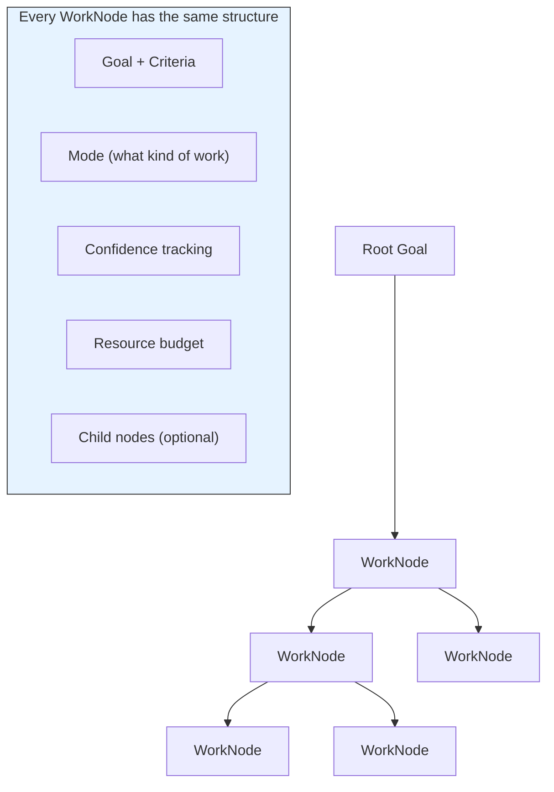

**Key insight**: The same structure works at every level. A root goal and its deepest subtask both have:
- A goal with acceptance criteria
- A mode (research, build, decide, verify)
- Confidence tracking
- Resource constraints
- The ability to spawn children

This uniformity enables:
- **Consistent scheduling** at any depth
- **Uniform confidence aggregation** up the tree
- **Predictable resource management** everywhere

---

## The Four Modes

Each WorkNode operates in one of four modes, depending on what work it needs to do:

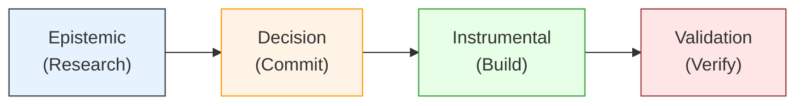

| Mode | Purpose | Output | Example |
|------|---------|--------|---------|
| **Epistemic** | Gather knowledge | Claims with confidence | "Research TTS providers" |
| **Decision** | Commit to a choice | Binding commitment | "Select ElevenLabs" |
| **Instrumental** | Build something | Artifacts | "Implement TTS integration" |
| **Validation** | Verify correctness | Pass/fail verdict | "Test audio quality" |

### The Shipping Gate

**Decision nodes are shipping gates** - they force the transition from research to implementation.

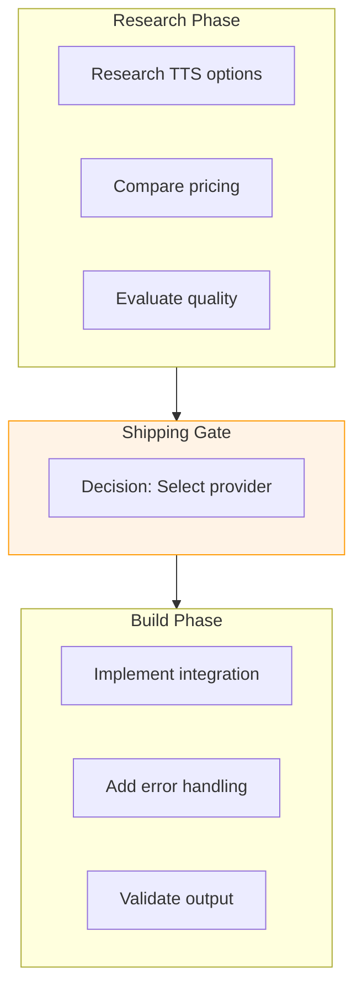

Without shipping gates, research can spiral indefinitely. The decision node forces commitment: "Based on what we know, we're going with X."

---

## Confidence and Autonomy

Every WorkNode tracks **confidence** - how certain we are that the goal is achieved.

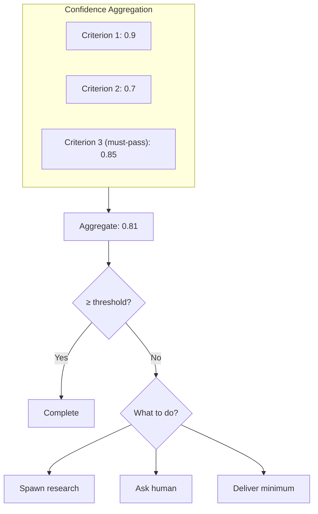

### Confidence Gating

The **autonomy gate** determines when a node can proceed:

| Confidence | Action |
|------------|--------|
| **≥ 0.8** | Auto-proceed (high confidence) |
| **0.5 - 0.8** | Spawn child research to fill gaps |
| **< 0.5** | Escalate to human review |

**Must-pass criteria** can block completion regardless of overall confidence. If a safety criterion scores 0.3, the node cannot complete even if everything else is 0.95.

---

## Goal Alignment

As goals decompose deeper, there's a risk of **goal drift** - subtasks that technically complete but don't serve the root objective.

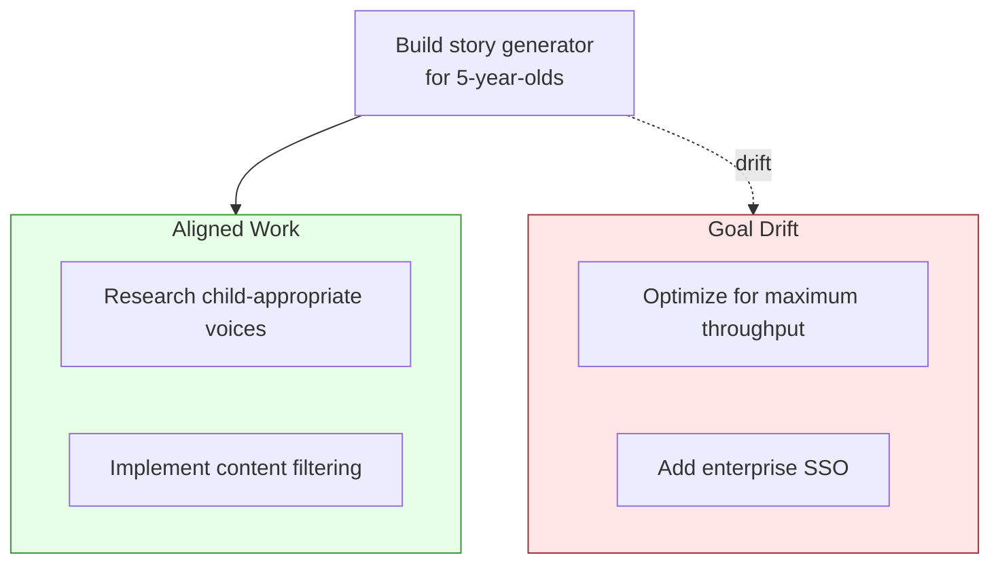

### The Goal Capsule

GOTN anchors every tree with a **Goal Capsule** - an immutable, checksummed root objective:

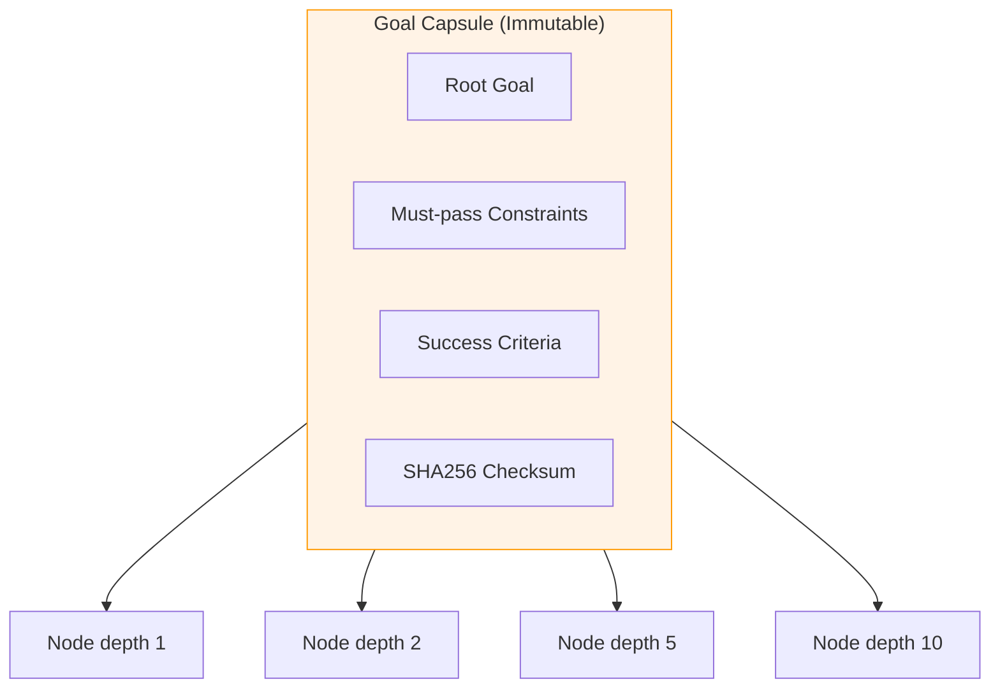

**Every node**, no matter how deep, can reference the capsule to verify alignment. Before spawning a child, the system checks:
- Does this child's goal serve the root objective?
- Does it violate any must-pass constraints?
- Is the alignment score above threshold?

---

## Context Management

Deep recursion creates a context problem: how do you give a depth-10 node enough information to work without exceeding context limits?

### Three-Tier Context Strategy

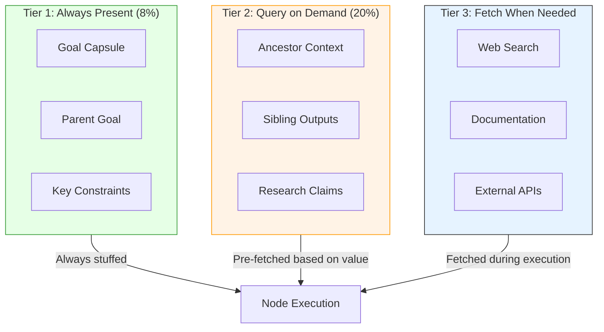

| Tier | What | When | Budget |
|------|------|------|--------|
| **Tier 1** | Goal capsule, parent goal, constraints | Always present | ~8% |
| **Tier 2** | Ancestor research, sibling outputs | Pre-fetched based on value | ~20% |
| **Tier 3** | External docs, web search | During execution if needed | Variable |

### Value of Information Gating

Not all context retrieval is worth the cost. GOTN uses **Value of Information (VoI)** to decide what to fetch:

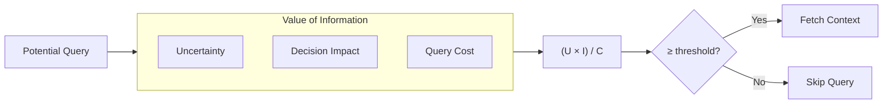

**High VoI scenarios**:
- Decision node with low confidence (high uncertainty, high impact)
- Must-pass criterion not yet satisfied
- Validation node checking critical output

**Low VoI scenarios**:
- Already high confidence (low uncertainty)
- Optional criterion on epistemic node
- Deep in a research branch with tight budget

---

## Node Lifecycle

Every WorkNode follows the same state machine:

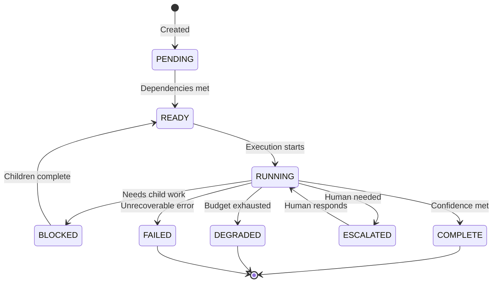

| State | Meaning |
|-------|---------|
| **PENDING** | Waiting for dependencies |
| **READY** | Can be scheduled for execution |
| **RUNNING** | Actively being worked on |
| **BLOCKED** | Waiting for child nodes to complete |
| **COMPLETE** | Successfully achieved goal |
| **DEGRADED** | Delivered minimum viable output |
| **ESCALATED** | Waiting for human input |
| **FAILED** | Unrecoverable error |

---

## The Execution Flow

Here's how a complex goal flows through GOTN:

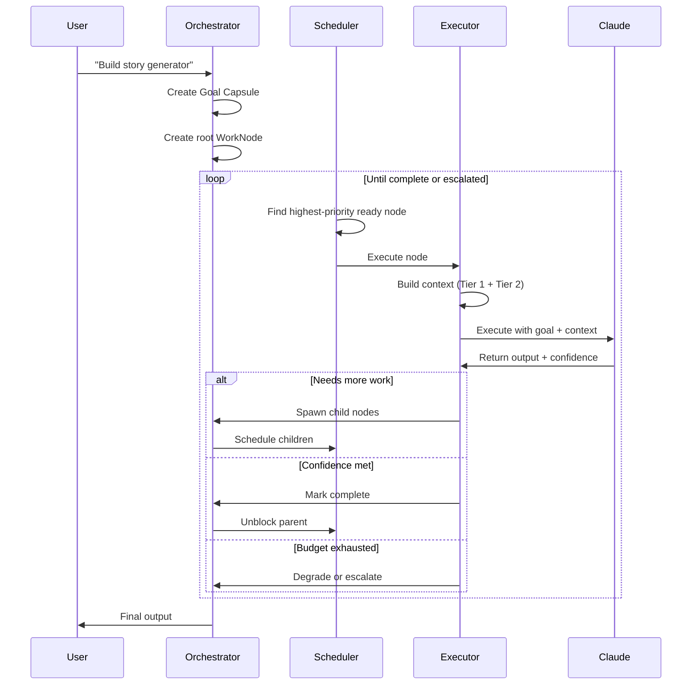

---

## Resource Protection

GOTN includes multiple safeguards against runaway execution:

### Circuit Breakers

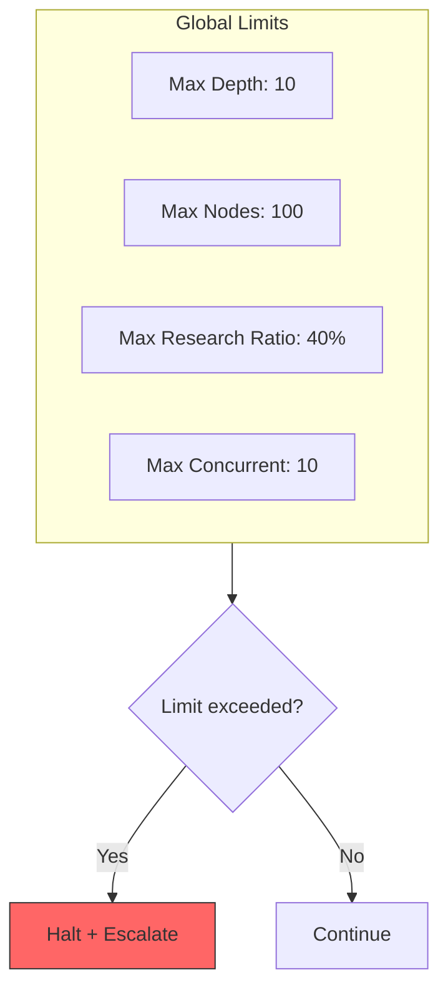

### Budget Enforcement

Every node has resource constraints:
- **Token budget** - Maximum LLM tokens
- **Time budget** - Maximum wall-clock time
- **Cost budget** - Maximum API spend
- **Step budget** - Maximum discrete operations

When budget exhausts, the node's **exit policy** determines what happens:
- **Degrade**: Deliver minimum viable output
- **Escalate**: Ask human for guidance
- **Fail**: Mark as failed, let parent handle

---

## Tree Structure Example

Here's how a real goal decomposes:

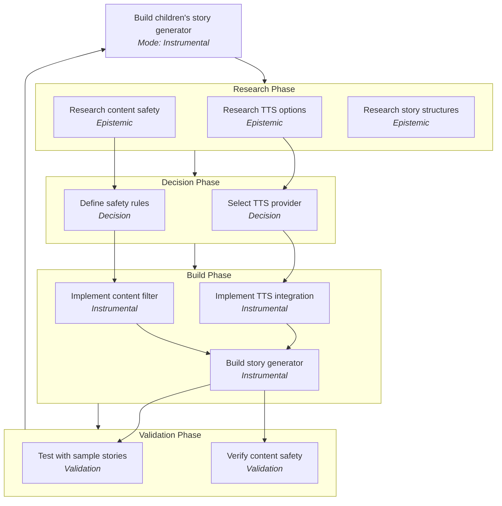

Each node in this tree:
- Has the same structure (goal, criteria, confidence, budget)
- Tracks its own completion independently
- Can spawn additional children if needed
- Reports confidence back to its parent
- Is anchored to the same Goal Capsule

---

## Integration with Claude Code

GOTN runs as a **Claude Code extension**, integrating through:

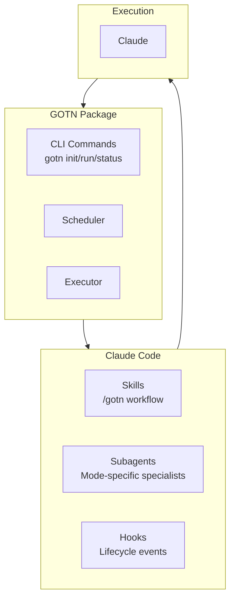

### Mode-Specific Tool Restrictions

Each mode gets appropriate tools:

| Mode | Allowed Tools |
|------|--------------|
| **Epistemic** | Read, Search, WebFetch |
| **Decision** | Read, Search (no modifications) |
| **Instrumental** | Read, Write, Edit, Bash |
| **Validation** | Read, Bash (tests only) |

This prevents research nodes from accidentally modifying code, or decision nodes from taking premature action.

---

## Key Benefits

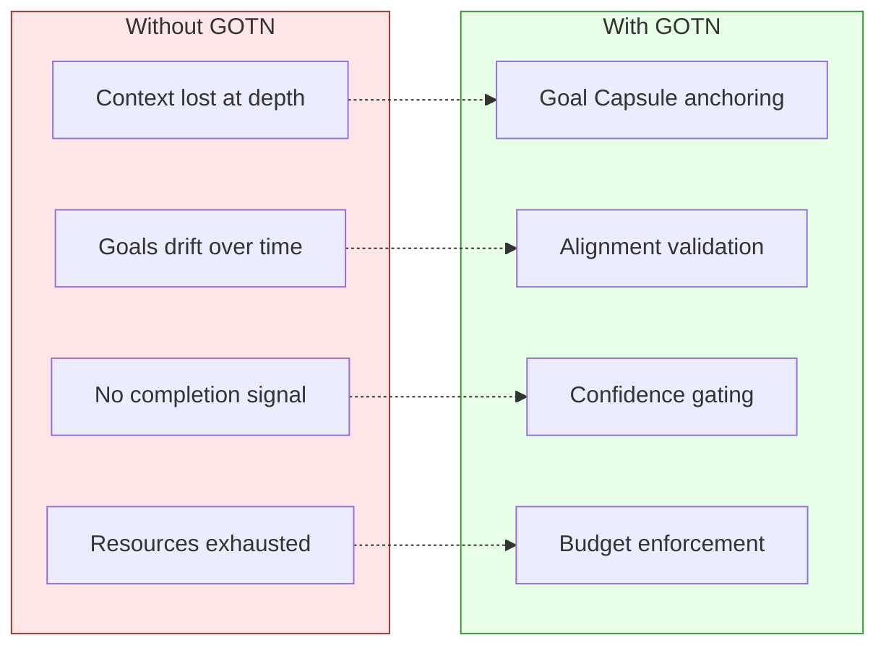

| Problem | Solution |
|---------|----------|
| Context lost at depth | Three-tier context with Goal Capsule always present |
| Goals drift | Alignment validation before spawning children |
| No completion signal | Confidence aggregation with autonomy gating |
| Resources exhausted | Budget tracking with circuit breakers |
| Endless research | Shipping gates force decision/build phases |

---

## Summary

GOTN enables complex AI workflows through:

1. **Self-similar structure** - Same WorkNode abstraction at every level
2. **Four modes** - Epistemic, Decision, Instrumental, Validation
3. **Confidence gating** - Clear signals for when work is "enough"
4. **Goal alignment** - Immutable Goal Capsule prevents drift
5. **Context efficiency** - Three-tier strategy scales to arbitrary depth
6. **Resource protection** - Budgets and circuit breakers prevent runaway
7. **Shipping gates** - Decision nodes force research → build transitions

The result: Complex goals decompose naturally, stay aligned to the root objective, and complete with appropriate confidence - all while respecting resource constraints.
