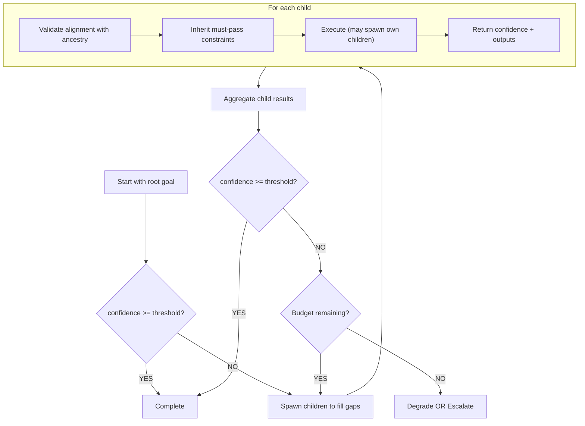
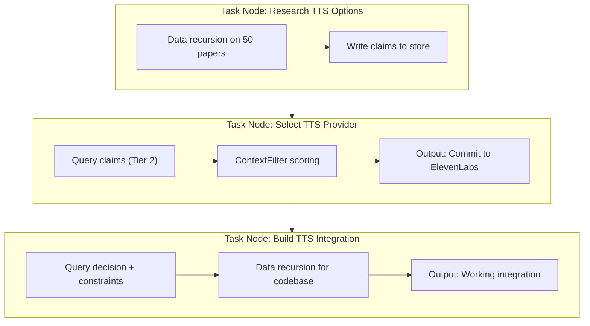
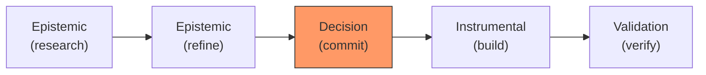
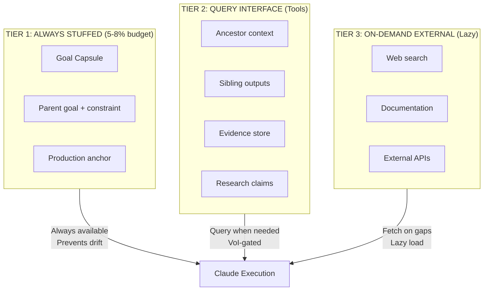
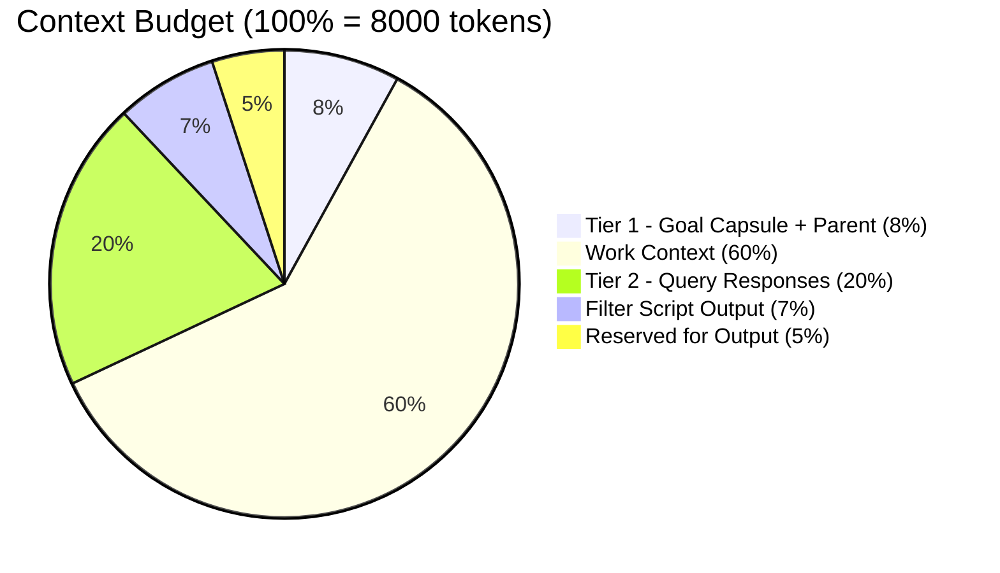
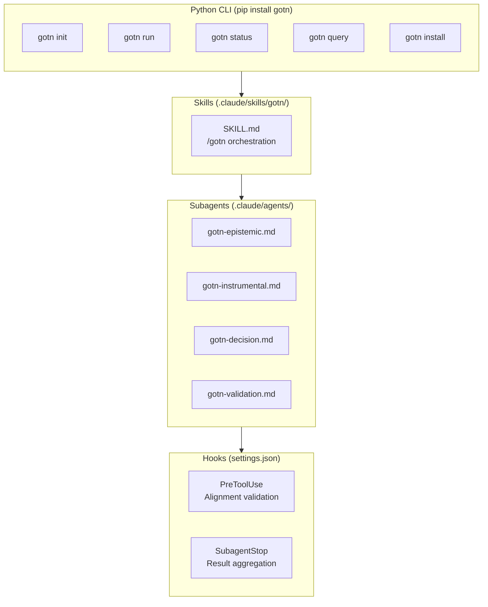

# GOTN Architecture

## What Problem Are We Solving?

Complex projects require **recursive decomposition**. A goal breaks into sub-goals, which break into sub-sub-goals, potentially many levels deep.

```
"Build story content generation system"
  └── "Research TTS options"
       └── "Evaluate ElevenLabs"
            └── "Test voice quality for children's content"
                 └── "Run sample generation with emotional tags"
```

The challenge: **each level needs to stay aligned with all levels above it**.

Without alignment, deep tasks drift:
```
"Build story content generation system"
  └── "Research TTS options"
       └── "Understand voice synthesis technology"
            └── "Study acoustic phonetics"
                 └── "Review papers on formant frequencies"  ← DRIFT
```

The phonetics research might be interesting, but it doesn't serve the root goal. We're building a story app, not writing a PhD thesis on acoustics.

**GOTN solves this with:**
1. **Recursive self-similar structure** - Same pattern at every level
2. **Automatic alignment** - Each node validates against its full ancestry
3. **Confidence tracking** - Know when a level has "enough" to proceed
4. **Thresholds** - Gates that control advancement

---

## The Core Model: Recursive Self-Similarity

Every node in GOTN has the same structure, regardless of depth:

```yaml
WorkNode:
  goal: "What are we trying to achieve?"
  criteria: "How do we know we succeeded?"
  confidence: "How sure are we?" (per criterion)
  threshold: "How sure do we need to be to proceed?"
  parent: "What spawned this node?"
  children: "What sub-tasks did we spawn?"
```

**Self-similarity means**: A node at depth 5 looks exactly like a node at depth 1. Same fields, same lifecycle, same rules.

```
Depth 0: Build story app           [goal, criteria, confidence, threshold]
  Depth 1: Research TTS            [goal, criteria, confidence, threshold]
    Depth 2: Evaluate ElevenLabs   [goal, criteria, confidence, threshold]
      Depth 3: Test voice quality  [goal, criteria, confidence, threshold]
```

This recursion is what enables complex projects - you can decompose to whatever depth is needed, and the system handles it uniformly.

---

## Alignment: The Key Mechanism

### The Problem

When a node spawns a child, the child might not actually serve the parent's goal. And even if it serves the parent, it might not serve the grandparent, or the root.

**Alignment ensures**: Every child node serves ALL ancestors up to the root.

### How It Works

Before spawning a child, GOTN checks:

1. **Does the child goal relate to the parent goal?**
2. **Does the child goal relate to the root goal?**
3. **Does the child inherit critical constraints from ancestors?**

```python
def spawn_child(parent, child_goal):
    # Check alignment with parent
    parent_alignment = compute_alignment(child_goal, parent.goal)

    # Check alignment with root (through full ancestry)
    root = get_root(parent)
    root_alignment = compute_alignment(child_goal, root.goal)

    # Weighted: 60% parent, 40% root
    overall = 0.6 * parent_alignment + 0.4 * root_alignment

    if overall < threshold:
        raise AlignmentError("Child goal doesn't serve tree objectives")

    # Propagate must-pass constraints from ancestors
    child.inherited_constraints = collect_must_pass(parent)

    return child
```

### The Goal Chain

To check alignment without passing the entire tree (context explosion), we compress the ancestry into a **Goal Chain**:

```
Goal Chain for depth-4 node:
┌─────────────────────────────────────────────────────┐
│ ROOT (depth 0): Build story content generation      │
│   └─ Key constraint: Age-appropriate (3-8 years)    │
│                                                     │
│ PARENT (depth 3): Test voice quality                │
│   └─ Key constraint: Must sound natural             │
│                                                     │
│ CURRENT (depth 4): Run sample with emotional tags   │
│                                                     │
│ Inherited constraints:                              │
│   - Age-appropriate content                         │
│   - Natural voice quality                           │
│   - Under budget ($0.01/minute)                     │
│                                                     │
│ Alignment score: 82%                                │
└─────────────────────────────────────────────────────┘
```

This compresses to ~500 tokens regardless of depth. The current node knows:
- What the root is trying to achieve
- What the immediate parent needs
- What constraints must be satisfied

### Constraint Propagation

**Must-pass constraints cascade down the tree.** If the root says "must be age-appropriate", every descendant inherits that constraint.

```yaml
# Root node
goal: "Build story content generation"
criteria:
  - description: "Age-appropriate for 3-8 years"
    must_pass: true  # ← This propagates to ALL children

# Depth 3 child automatically inherits:
inherited_constraints:
  - "[Inherited] Age-appropriate for 3-8 years"
```

This ensures that no matter how deep the decomposition goes, critical requirements aren't forgotten.

---

## Confidence and Thresholds

### Why Confidence Matters

At each level, you need to know: **Do I have enough information to proceed?**

Without confidence tracking:
- Research might stop too early (missed important considerations)
- Research might continue forever (analysis paralysis)
- Parent nodes don't know if children actually answered the question

### Per-Criterion Confidence

Each criterion on a goal gets its own confidence score:

```yaml
goal: "Evaluate ElevenLabs for children's TTS"
criteria:
  - description: "Voice quality acceptable for children"
    confidence: 0.85
    evidence: ["Tested 5 voice samples", "Kids focus group positive"]

  - description: "Cost within budget"
    confidence: 0.95
    evidence: ["Pricing confirmed at $0.008/minute"]

  - description: "API reliable"
    confidence: 0.60
    evidence: ["Read docs, no live testing yet"]
```

### Threshold Logic

```
If confidence >= threshold:
    → Mark complete, return to parent

If confidence < threshold AND budget remaining:
    → Spawn more research

If confidence < threshold AND budget exhausted:
    → Degrade (partial answer) OR escalate (ask human)
```

### Aggregation

Overall confidence combines criteria:

```python
def aggregate(criteria):
    must_pass = [c for c in criteria if c.must_pass]
    optional = [c for c in criteria if not c.must_pass]

    # Must-pass: use minimum (if any fails, overall fails)
    must_pass_score = min(c.confidence for c in must_pass) if must_pass else 1.0

    # Optional: weighted average
    optional_score = weighted_mean(c.confidence for c in optional) if optional else 1.0

    # Combine: 60% must-pass, 40% optional
    return 0.6 * must_pass_score + 0.4 * optional_score
```

---

## The Recursive Workflow

Here's how it all fits together:



### Example Trace

```
[ROOT] Build story content generation (confidence: 0%)
  │
  ├─ Spawn: Research TTS (aligned: 95%)
  │   │
  │   ├─ Spawn: Evaluate ElevenLabs (aligned: 88%)
  │   │   │
  │   │   ├─ Spawn: Test voice quality (aligned: 85%)
  │   │   │   └─ COMPLETE (confidence: 90%)
  │   │   │
  │   │   ├─ Spawn: Check pricing (aligned: 92%)
  │   │   │   └─ COMPLETE (confidence: 98%)
  │   │   │
  │   │   └─ COMPLETE (confidence: 87%)
  │   │
  │   ├─ Spawn: Evaluate Google TTS (aligned: 86%)
  │   │   └─ ... (similar structure)
  │   │
  │   └─ COMPLETE (confidence: 85%)
  │
  ├─ Spawn: Research story structure (aligned: 91%)
  │   └─ ... (similar structure)
  │
  └─ DECISION: Commit to ElevenLabs (confidence: 88%)
      │
      └─ Spawn: Build TTS integration (aligned: 94%)
          └─ ... (instrumental work)
```

Each spawn is validated for alignment. Each completion rolls up confidence. The tree grows and contracts as needed.

---

## Dual Recursion: Task + Data

GOTN supports two orthogonal recursion modes that can be composed:

### Task Recursion (GOTN-Style)

Traditional goal decomposition: a WorkNode spawns child WorkNodes.

```
WorkNode (Research TTS)
  ├── spawn → WorkNode (Evaluate ElevenLabs)
  ├── spawn → WorkNode (Evaluate Google TTS)
  └── spawn → WorkNode (Evaluate Azure)

Parent BLOCKED until children complete
Results aggregated via confidence model
Each child is a separate execution context
```

**Use for**: Goal decomposition, heterogeneous sub-tasks, explicit contracts.

### Data Recursion (RLM-Style)

Process large data within a single node via recursive self-calls on segments.

```
WorkNode (Analyze 50 research papers)
  │
  ├── segment_call(papers[0:10]) → claims[]
  ├── segment_call(papers[10:20]) → claims[]
  ├── segment_call(papers[20:30]) → claims[]
  ├── segment_call(papers[30:40]) → claims[]
  └── segment_call(papers[40:50]) → claims[]
  │
  └── aggregate(all_claims) → final_output

Same node identity throughout
Shared environment/store across calls
No child WorkNodes spawned (cheaper)
```

**Use for**: Homogeneous data processing, when spawning nodes is overhead.

### Composition: Hybrid Patterns

The two modes compose naturally:



### When to Use Which

| Pattern | Characteristics | Example |
|---------|-----------------|---------|
| Task Recursion | Different goals, explicit contracts, need isolation | Research → Decision → Build |
| Data Recursion | Same operation on segments, shared context, cheap | Analyze 50 papers, process log files |
| Hybrid | Task decomposition with data-heavy sub-tasks | Research node internally uses data recursion |

### Implementation

Data recursion is implemented as a **segment processor mode** on WorkNode:

```python
class WorkNode:
    # ... existing fields ...

    # Data recursion support
    segment_mode: bool = False
    segment_schema: Optional[str] = None  # Expected output format
    aggregation_fn: Optional[str] = None  # How to combine results

def execute_with_data_recursion(node: WorkNode, data: list, chunk_size: int = 10):
    """Execute node with RLM-style data recursion."""
    claims = []

    for i in range(0, len(data), chunk_size):
        chunk = data[i:i + chunk_size]

        # Same node, different data segment
        result = execute_segment(node, chunk)
        claims.extend(result.claims)

        # Write to shared store immediately
        graph.save_claims(node.id, result.claims)

    # Aggregate all claims
    return aggregate_claims(claims, node.aggregation_fn)
```

---

## The Four Node Types

All nodes have the same structure, but differ in what they produce:

| Type | Purpose | Output | Typical Children |
|------|---------|--------|------------------|
| **Epistemic** | Learn something | Knowledge, findings | More epistemic, or decision |
| **Decision** | Commit to something | Binding choice | Instrumental |
| **Instrumental** | Build something | Artifacts | Validation, more instrumental |
| **Validation** | Verify something | Pass/fail | None (usually leaf) |

### The Flow



**Decision nodes are shipping gates** - they force the transition from research to implementation. You can't build until you've committed.

---

## Context Management

### The Problem at Depth

A node at depth 5 needs context, but passing the entire tree would explode the context window. Yet alignment requires understanding the full ancestry—immediate parent for task context, root for ultimate objective.

**The tension**: Alignment patches imperfectly articulated sub-goals. Every sub-goal is imperfectly articulated (natural language is lossy), so deeper nodes need MORE ancestor context to stay aligned, but have LESS budget to spend on it.

### Hybrid Context Strategy: RLM + GOTN

Traditional approaches stuff all context into the prompt upfront. This wastes tokens on information that may not be needed and limits recursion depth.

GOTN uses a **hybrid approach** inspired by Recursive Language Models (RLM):

1. **Eager (Tier 1)**: Always-present alignment-critical context
2. **Query (Tier 2)**: On-demand access to graph via tools
3. **Lazy (Tier 3)**: External fetches only when gaps detected



### When to Use Which Tier

| Scenario | Tier | Rationale |
|----------|------|-----------|
| Root goal + must-pass constraints | Tier 1 | Alignment-critical, always needed |
| Parent goal + immediate context | Tier 1 | Task relevance, always needed |
| Grandparent+ ancestry | Tier 2 | Query when confidence < threshold |
| Sibling research findings | Tier 2 | Query when synthesizing |
| External documentation | Tier 3 | Only when gaps identified |

### Goal Capsule

The **Goal Capsule** is an immutable, checksummed object that anchors alignment:

```yaml
GoalCapsule:
  id: "capsule-abc123"
  root_goal: "Build NES story content generation system"
  constraints:
    - "Age-appropriate for 3-8 years"
    - "Budget under $0.01/minute for TTS"
  success_criteria:
    - "Working story generation pipeline"
    - "Content passes quality review"
  checksum: "sha256:a1b2c3..."  # Tamper detection
```

**Every node must**:
1. Reference a Goal Capsule at spawn time
2. Validate capsule checksum before output
3. Include capsule ID in completion report

If the checksum mismatches, execution halts—the goal has drifted.

### VoI-Gated Retrieval

When should a node query Tier 2 instead of proceeding with Tier 1 only?

Use **Value of Information (VoI) gating**:

```
query_tier2 = (uncertainty × decision_impact) / query_cost > threshold

Where:
  uncertainty = 1 - confidence
  decision_impact = ancestor_depth_weight × contract_criticality
  query_cost = estimated_tokens + latency_penalty
```

**Triggers for mandatory Tier 2 retrieval**:
- Confidence < 0.7 on any must-pass criterion
- Contract constraint unresolved
- Parent explicitly requires ancestor context

#### Implementation: `context.py`

The VoI-gated retrieval is implemented in `src/gotn/context.py`:

```python
from gotn.context import ContextBuilder, ContextBudget, VoIFactors

# Token budget allocation
budget = ContextBudget(total_tokens=8000)
# Tier 1: 8% (640 tokens) - Goal chain, capsule, constraints
# Tier 2: 20% (1600 tokens) - Ancestors, siblings, claims
# Work: 60% (4800 tokens) - Claude's reasoning
# Reserve: 12% (960 tokens) - Output buffer

# VoI calculation
voi = VoIFactors(
    uncertainty=1 - node.confidence.aggregate,
    decision_impact=0.5,  # Higher for decision/validation modes
    query_cost=1.0 + (node.depth * 0.1),  # Deeper = more expensive
)
if voi.value >= 0.3:  # VOI_THRESHOLD
    # Pre-fetch Tier 2 data
    ...
```

**Key design decision**: Tier 2 data is **pre-fetched before Claude execution** based on VoI calculation. This eliminates the need for runtime queries (which would require Bash access), solving the architectural conflict where epistemic/decision modes couldn't access `gotn query` commands.

### ContextFilter: Code-Based Pre-Processing

Before LLM reasoning, nodes can run **deterministic code filters** on retrieved data. This is inspired by RLM's Python REPL approach.

```python
class ContextFilter:
    """Code-based pre-processing for retrieved context."""

    def __init__(self, filter_code: str, timeout_ms: int = 1000):
        self.code = filter_code
        self.timeout = timeout_ms
        self.env = {"re": re, "json": json}  # Safe subset

    def apply(self, raw_context: dict) -> dict:
        """Execute filter code on retrieved data."""
        # Sandboxed execution - no filesystem/network
        exec(self.code, self.env, {"ctx": raw_context})
        return self.env.get("result", raw_context)
```

**Example filter for an implementation node**:

```python
# Attached to instrumental node - runs before LLM prompt
result = {
    # Only committed decisions, not exploratory research
    "decisions": [c for c in ctx["claims"] if "committed:" in c["scope"]],

    # Only configuration constraints from ancestors
    "constraints": [c for c in ctx["ancestor_claims"]
                    if c["domain"] == "configuration"],

    # Just the API spec, not the full research
    "api_specs": ctx.get("artifacts", {}).get("api_design"),
}
```

**Benefits**:
- 10x cheaper than LLM token consumption
- Deterministic, reproducible filtering
- Reduces noise before semantic processing

### Context Budget Model (Updated)

With the hybrid approach, the budget shifts:



The 20% previously allocated to ancestor chain is now available for work context, with ancestors accessed on-demand via Tier 2 queries.

### Ancestor Allocation with Decay

The 20% goal chain budget is distributed across ancestors using **exponential decay with guaranteed root allocation**.

**Principle**:
- Root always gets context (alignment to ultimate objective)
- Parent gets the most (immediate task context)
- Intermediate ancestors decay exponentially (each level gets half the previous)

**Example allocations**:

| Depth | Parent | Grandparent | Great-GP | Root |
|-------|--------|-------------|----------|------|
| 1 | - | - | - | 20% |
| 2 | 15% | - | - | 5% |
| 3 | 8% | 7% | - | 5% |
| 4 | 8% | 4.7% | 2.3% | 5% |
| 5 | 8% | 3.5% | 1.75% | 5% |

> **Implementation**: See [context-management.md](context-management.md#ancestor-allocation-with-decay) for the `allocate_ancestor_budget()` function.

### Summarization Levels

Each ancestor is summarized to fit its budget:

| Budget | Detail Level |
|--------|--------------|
| 400+ tokens | Full: goal, all criteria, key constraints |
| 200-400 tokens | Medium: goal, must-pass criteria only |
| 100-200 tokens | Compressed: goal summary + single constraint |
| <100 tokens | Minimal: single sentence objective |

### Progressive Summarization

**The "summary frontier"**: At any depth, you have:
- Full detail for parent
- Medium detail for grandparent
- Compressed detail for great-grandparent
- Minimal detail for ancestors beyond that
- Always some root context

### Evidence Selection

Evidence budget uses **semantic relevance**, not "include everything":
- Score each evidence item by relevance to current goal
- Sort by relevance, take top items that fit budget
- Stop if relevance drops below threshold (0.3)

> **Implementation**: See [context-management.md](context-management.md) for `summarize_for_budget()`, `build_goal_chain()`, and `select_evidence()` functions.

### Output Collapse

When a node completes, its internal trace (10k+ tokens) collapses to a summary (~200 tokens):

**Before**: Full goal, all criteria, child trees, execution log, all evidence
**After**: Status, confidence, summary, key findings, deliverable reference

Parents see the summary. The full trace is persisted to disk but not loaded into context.

### Fail-Fast on Budget Overflow

Before execution, validate that the prompt fits the budget. If it exceeds, raise `ContextOverflowError` before Claude invocation—don't discover overflow mid-execution.

---

## Claude Code Integration

GOTN is a **self-contained package** that orchestrates Claude Code via CLI. It installs globally or per-project and integrates through Claude Code's extensibility mechanisms: Skills, Subagents, Hooks, and Plugins.

### Architecture Overview



### CLI Invocation Pattern

GOTN executes nodes via `claude --print` with **schema-enforced structured output**:

```python
# Core execution pattern
cmd = [
    "claude",
    "--print",
    "--output-format", "json",
    "--json-schema", json.dumps(GOTN_OUTPUT_SCHEMA),
    "--allowedTools", ",".join(get_tools_for_mode(node.mode)),
    "--max-turns", str(node.budget.steps or 10),
    "--append-system-prompt", context,
    node.goal.statement
]
```

**Key CLI flags:**

| Flag | Purpose |
|------|---------|
| `--print` / `-p` | Non-interactive mode, returns result and exits |
| `--output-format json` | Structured JSON output with message types |
| `--json-schema` | **Enforces output schema** via StructuredOutput tool |
| `--allowedTools` | Restricts available tools per mode |
| `--append-system-prompt` | Injects goal chain, constraints, context |
| `--max-turns` | Limits agentic turns (budget control) |

### Structured Output Schema

The `--json-schema` flag guarantees response format. Claude uses an internal `StructuredOutput` tool to comply:

```python
GOTN_OUTPUT_SCHEMA = {
    "type": "object",
    "properties": {
        "claims": {
            "type": "array",
            "items": {
                "type": "object",
                "properties": {
                    "proposition": {"type": "string"},
                    "confidence": {"type": "number", "minimum": 0, "maximum": 1},
                    "domain": {"type": "string"}
                },
                "required": ["proposition", "confidence"]
            }
        },
        "criterion_status": {
            "type": "array",
            "items": {
                "type": "object",
                "properties": {
                    "satisfied": {"type": "boolean"},
                    "confidence": {"type": "number"}
                },
                "required": ["satisfied", "confidence"]
            }
        },
        "needs_children": {
            "type": "array",
            "items": {
                "type": "object",
                "properties": {
                    "goal": {"type": "string"},
                    "mode": {"type": "string", "enum": ["epistemic", "decision", "instrumental", "validation"]},
                    "rationale": {"type": "string"}
                },
                "required": ["goal", "mode"]
            }
        },
        "output": {
            "type": "object",
            "properties": {
                "type": {"type": "string"},
                "summary": {"type": "string"},
                "content": {"type": "string"}
            }
        }
    },
    "required": ["claims", "criterion_status"]
}
```

**Result parsing:**

```python
def parse_claude_result(stdout: str) -> NodeResult:
    """Parse NDJSON output from claude --print --output-format json."""
    messages = [json.loads(line) for line in stdout.strip().split('\n')]

    for msg in messages:
        if msg.get("type") == "result":
            return NodeResult(
                structured_output=msg.get("structured_output"),  # Schema-validated
                cost_usd=msg.get("total_cost_usd"),
                usage=msg.get("usage"),
                duration_ms=msg.get("duration_ms")
            )
```

### Mode-Specific Tool Restrictions

Each node mode gets a tailored tool set via `--allowedTools`:

```python
MODE_TOOLS = {
    NodeMode.EPISTEMIC: [
        "Read", "Glob", "Grep", "WebSearch", "WebFetch", "Task"
    ],
    NodeMode.INSTRUMENTAL: [
        "Read", "Write", "Edit", "Bash", "Glob", "Grep"
    ],
    NodeMode.DECISION: [
        "Read", "Grep", "WebSearch", "Task"  # No write tools
    ],
    NodeMode.VALIDATION: [
        "Read", "Bash", "Grep", "Glob"  # Test execution only
    ],
}
```

### Skills

Skills are Claude Code's mechanism for complex, reusable workflows. GOTN exposes a `/gotn` skill:

```markdown
<!-- .claude/skills/gotn/SKILL.md -->
---
name: gotn
description: Goal-Oriented Task Network orchestration. Use when managing
  recursive goal decomposition, research workflows, or multi-step projects
  that need alignment tracking and confidence gating.
---

# GOTN Orchestration

You are executing within the GOTN workflow system.

## Commands

- `gotn init "<goal>"` - Create a new goal tree
- `gotn run` - Execute the next ready node
- `gotn run --continuous` - Execute until blocked or complete
- `gotn status` - Show tree status
- `gotn status --tree` - Show full DAG structure

## Tier 2 Queries (Context Retrieval)

When you need additional context beyond what's in your prompt:

- `gotn query ancestors` - Get ancestor goals and constraints
- `gotn query claims --domain X` - Get research claims from siblings
- `gotn query siblings` - Get outputs from completed peer nodes

## Output Format

Your response MUST include structured output matching the GOTN schema.
The system will extract claims, criterion status, and child requests.
```

### Subagents

Subagents are mode-specific execution specialists spawned via the Task tool:

```markdown
<!-- .claude/agents/gotn-epistemic.md -->
---
name: gotn-epistemic
description: Research specialist for GOTN epistemic nodes. Executes research
  goals with comprehensive information gathering and claim extraction.
tools:
  - Read
  - Glob
  - Grep
  - WebSearch
  - WebFetch
  - Task
---

# GOTN Epistemic Agent

You are executing a GOTN epistemic (research) node.

## Your Objective
Research the given goal thoroughly, gathering evidence from multiple sources.

## Context Retrieval
If you need additional context, use bash to query the GOTN store:
- `gotn query ancestors --format compact` - Ancestor goals
- `gotn query claims --min-confidence 0.7` - Existing research

## Output Requirements
Your findings must be structured for the parent orchestrator:
- Extract concrete claims with confidence scores
- Note which acceptance criteria are satisfied
- Identify if child research is needed
```

```markdown
<!-- .claude/agents/gotn-instrumental.md -->
---
name: gotn-instrumental
description: Build specialist for GOTN instrumental nodes. Implements
  solutions based on committed decisions and constraints.
tools:
  - Read
  - Write
  - Edit
  - Bash
  - Glob
  - Grep
---

# GOTN Instrumental Agent

You are executing a GOTN instrumental (build) node.

## Your Objective
Implement the specified goal following committed decisions and constraints.

## Before Building
Query for relevant decisions and constraints:
- `gotn query claims --scope "committed:*"` - Binding decisions
- `gotn query ancestors --format constraints` - Must-satisfy requirements

## Output Requirements
- Document what was built
- Confirm constraint satisfaction
- Note any deviations or issues
```

### Hooks

Hooks provide lifecycle integration without consuming context.

**SECURITY NOTE**: Hook commands receive input via **stdin as JSON** to prevent shell injection (CWE-78).
Environment variables like `$TOOL_INPUT` should NEVER be interpolated directly into command strings.
The hook command reads structured JSON from stdin and parses it safely.

```json
{
  "hooks": {
    "PreToolUse": [
      {
        "matcher": "Write",
        "command": "gotn hooks validate-alignment",
        "input": "stdin",
        "description": "Validate file writes align with goal constraints"
      }
    ],
    "PostToolUse": [
      {
        "matcher": "Bash",
        "command": "gotn hooks track-execution",
        "input": "stdin",
        "description": "Track tool execution for resource accounting"
      }
    ],
    "SubagentStop": [
      {
        "command": "gotn hooks aggregate-result",
        "input": "stdin",
        "description": "Aggregate subagent outputs into parent node"
      }
    ]
  }
}
```

**Stdin JSON format** (provided by Claude Code):
```json
{
  "tool_name": "Write",
  "tool_input": {"file_path": "/path/to/file", "content": "..."},
  "tool_result": "...",
  "session_id": "...",
  "node_context": {"id": "node-xxx", "mode": "instrumental"}
}
```

**Hook capabilities:**
- **PreToolUse**: Validate alignment before destructive operations
- **PostToolUse**: Track resource usage, update node state
- **SubagentStop**: Aggregate child results, update confidence

### Why Not MCP?

We considered MCP servers for Tier 2 queries but rejected them:

| Concern | MCP Approach | CLI Approach |
|---------|--------------|--------------|
| **Deployment** | Separate process to manage | Single `pip install` |
| **Context cost** | Protocol overhead + tool schemas | Minimal - just CLI output |
| **Control** | MCP decides response format | We control exact output size |
| **Distribution** | Server config + startup scripts | Copy skills + agents |

**CLI-backed skills achieve everything MCP can** with tighter context control—critical for a globally-installed tool.

---

## Data Strategy: Kuzu Graph Database

GOTN uses **Kuzu**, an embedded graph database, for storage and queries. The data model naturally fits a graph - nodes with typed relationships, ancestry traversal, and dependency edges.

### Why Kuzu

| Need | Solution |
|------|----------|
| Tree traversal | Native Cypher path queries (`[:PARENT*]`) |
| Relationship queries | Graph-native, O(1) edge traversal |
| Embedded deployment | Single directory, no server |
| Python integration | `pip install kuzu`, in-process |

### Core Tables

- **GoalCapsule** - Immutable root goal anchor with checksum
- **WorkNode** - Goal, mode, status, depth, confidence, context policy
- **Claim** - Proposition, confidence, domain, scope
- **Evidence** - Content, summary, domain, strength

### Key Relationships

- `PARENT` / `SPAWNED_BY` - Tree structure
- `DEPENDS_ON` / `ENABLES` - DAG dependencies
- `HAS_CAPSULE` / `ANCHORED_TO` - Goal anchoring
- `HAS_CLAIM` / `HAS_EVIDENCE` / `SUPPORTS` - Evidence tracking

### Tier 2 Query Commands

```bash
gotn query ancestors [--depth-limit N] [--format compact|full]
gotn query claims [--domain X] [--min-confidence 0.5]
gotn query siblings [--status complete]
gotn query capsule
```

> **Implementation**: See [graph-store.md](graph-store.md) for full Cypher schema, query examples, and Python integration.

---

## Implementation Approach

Given that alignment, confidence, and recursion are all essential:

### Keep from Current Implementation

- **WorkNode structure** - The self-similar node model
- **State machine** - Node lifecycle management
- **Alignment module** - Goal chain, alignment scoring, constraint propagation
- **Confidence aggregation** - Per-criterion tracking, must-pass logic
- **Scheduler** - Manages execution order, concurrency

### Simplify or Remove

- **Complex edge types** - Keep spawned_by and depends_on, simplify others
- **VOI gating** - Can add later if needed
- **Semantic cache** - Nice to have, not essential for core

### Add

- **Workflow definitions** - YAML files that define common patterns
- **Better context compression** - More sophisticated goal chain building
- **Output collapse** - Automatic summarization on completion

---

## Packaging and Distribution

GOTN is distributed as a **self-contained Python package** with Claude Code integration assets.

### Package Structure

```
gotn/
├── pyproject.toml              # Package configuration
├── src/
│   └── gotn/                   # Python package
│       ├── __init__.py
│       ├── cli.py              # Typer CLI (gotn command)
│       ├── node.py             # WorkNode models
│       ├── state.py            # State machine
│       ├── scheduler.py        # DAG scheduling (with depth/node limits)
│       ├── executor.py         # Claude subprocess execution (with retry)
│       ├── context.py          # Three-tier context management (VoI-gated)
│       ├── graph.py            # Kuzu graph store
│       ├── confidence.py       # Aggregation logic
│       ├── alignment.py        # Goal alignment checking
│       └── hooks.py            # Hook command handlers
├── skills/
│   └── gotn/
│       └── SKILL.md            # /gotn skill definition
├── agents/
│   ├── gotn-epistemic.md
│   ├── gotn-instrumental.md
│   ├── gotn-decision.md
│   └── gotn-validation.md
├── hooks/
│   └── settings.json           # Hook configurations
└── tests/
```

### Installation Methods

**From PyPI (recommended):**
```bash
pip install gotn

# Install Claude Code integration (skills, agents, hooks)
gotn install --global     # ~/.claude/
gotn install --project    # ./.claude/
```

**From GitHub:**
```bash
pip install git+https://github.com/mikewrather/gotn.git
gotn install --global
```

**Claude Code Plugin (marketplace):**
```bash
# Register GOTN as a plugin marketplace
claude plugin marketplace add mikewrather/gotn

# Install the plugin
claude plugin install gotn@gotn-plugin
```

### The `gotn install` Command

Copies skills, agents, and hooks to the Claude Code configuration directory:
- `--global` installs to `~/.claude/`
- `--project` installs to `./.claude/`
- Default: project if `.claude/` exists, otherwise global

### Environment Variables

| Variable | Purpose |
|----------|---------|
| `GOTN_STORE` | Path to graph database (default: `./store`) |
| `GOTN_CURRENT_NODE` | ID of currently executing node |
| `GOTN_CURRENT_TREE` | ID of current goal tree |
| `GOTN_CAPSULE_ID` | ID of active goal capsule |

### Retry Logic

CLI execution includes exponential backoff (1s → 2s → 4s, max 30s) for transient failures:

**Retryable**: Rate limits, connection errors, server errors (5xx)
**Non-retryable**: Timeouts, auth errors, invalid input

### Tree Size Limits

The scheduler enforces `MAX_DEPTH=10` and `MAX_NODES=100` to prevent resource exhaustion. Raises `DepthLimitExceeded` or `NodeLimitExceeded` when limits would be breached.

### Version Compatibility

| GOTN Version | Claude Code Version | Python Version |
|--------------|---------------------|----------------|
| 0.1.x | 2.0+ | 3.10+ |

The `--json-schema` flag requires Claude Code 2.0+. Earlier versions fall back to YAML parsing.

---

## Summary

**GOTN is a self-contained, CLI-backed orchestration system for Claude Code** that enables recursive goal decomposition with alignment tracking and confidence gating.

### Core Principles

1. **Goals decompose recursively** - Each level can spawn children as needed
2. **Every level has the same structure** - Self-similar nodes all the way down
3. **Alignment is automatic** - Children validate against Goal Capsule before spawning
4. **Confidence gates progress** - Nodes complete when they have "enough"
5. **Constraints propagate** - Must-pass criteria cascade to all descendants

### Context Efficiency (RLM Synthesis)

6. **Three-tier context** - Eager (Tier 1) + Query (Tier 2) + Lazy (Tier 3)
7. **Goal Capsule anchoring** - Immutable, checksummed root goal prevents drift
8. **Code-based filtering** - ContextFilter scripts reduce token consumption 10x
9. **Dual recursion** - Task recursion for goals, data recursion for large datasets
10. **VoI-gated retrieval** - Query Tier 2 only when value exceeds cost

### Claude Code Integration

11. **Schema-enforced output** - `--json-schema` guarantees structured responses
12. **Mode-specific tools** - `--allowedTools` restricts tools per node type
13. **Skills for orchestration** - `/gotn` skill provides workflow entry point
14. **Subagents for execution** - Mode-specific specialists (epistemic, instrumental, etc.)
15. **Hooks for lifecycle** - PreToolUse validation, PostToolUse tracking
16. **CLI-backed queries** - Tier 2 via `gotn query` commands (no MCP overhead)

### Trade-off Summary

| Scenario | Strategy |
|----------|----------|
| Alignment-critical context | Tier 1 (always stuff) |
| Ancestor research | Tier 2 (`gotn query ancestors`) |
| External documentation | Tier 3 (lazy fetch) |
| 50+ papers to analyze | Data recursion (no child nodes) |
| Research → Decision → Build | Task recursion (explicit contracts) |
| Structured responses | `--json-schema` (not YAML parsing) |
| Tool management | MCP avoided; CLI-backed skills |

### Installation

```bash
pip install gotn
gotn install --global  # or --project
```

The system handles the manual orchestration burden while ensuring that no matter how deep the decomposition goes, every node serves the root objective—with efficient context access that scales to arbitrary depth, all as a self-contained package with no external services required.

---

## Implementation Status

*Last updated: 2026-01-13*

### Core Components (Implemented)

| Component | File | Status | Notes |
|-----------|------|--------|-------|
| WorkNode model | `node.py` | ✅ Complete | Pydantic models, auto-ID generation |
| State machine | `state.py` | ✅ Complete | All transitions, event bus |
| DAG scheduler | `scheduler.py` | ✅ Complete | Priority queue, depth/node limits |
| Goal alignment | `alignment.py` | ✅ Complete | Keyword overlap + concept expansion |
| Graph store | `graph.py` | ✅ Complete | Kuzu integration |
| CLI | `cli.py` | ✅ Complete | Typer-based, init/run/status |
| Executor | `executor.py` | ✅ Complete | Claude subprocess with retry |
| Context builder | `context.py` | ✅ Complete | Three-tier, VoI-gated |

### Architecture Review Fixes

The following issues from the [2026-01-13 architecture review](architecture-review-2026-01-13.md) have been addressed:

| Issue | Priority | Status | Implementation |
|-------|----------|--------|----------------|
| Tier 2 queries blocked | P0 | ✅ Fixed | VoI pre-fetch in `context.py` |
| Context budget tracking | P0 | ✅ Fixed | `ContextBudget` class |
| Shell injection in hooks | P0 | ✅ Fixed | Stdin JSON, not interpolation |
| Criterion IDs in schema | P1 | ✅ Fixed | IDs in prompt, output format |
| CLI retry logic | P1 | ✅ Fixed | `RetryConfig`, exponential backoff |
| Depth/node limits | P1 | ✅ Fixed | `MAX_DEPTH=10`, `MAX_NODES=100` |

### Test Coverage

```
54 tests passing:
- 12 alignment tests
- 17 context tests
- 13 executor tests
- 10 scheduler tests
- 7 state tests
```

### Remaining Work

| Item | Priority | Status |
|------|----------|--------|
| Semantic embeddings for alignment | P2 | Planned |
| VOI gating enforcement | P2 | Documented |
| Goal Capsule signatures | P3 | Documented |
| ContextFilter sandboxing | P3 | Documented |
