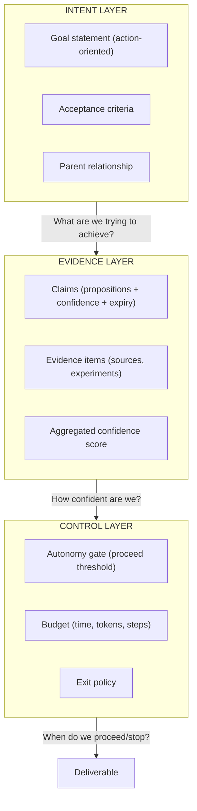
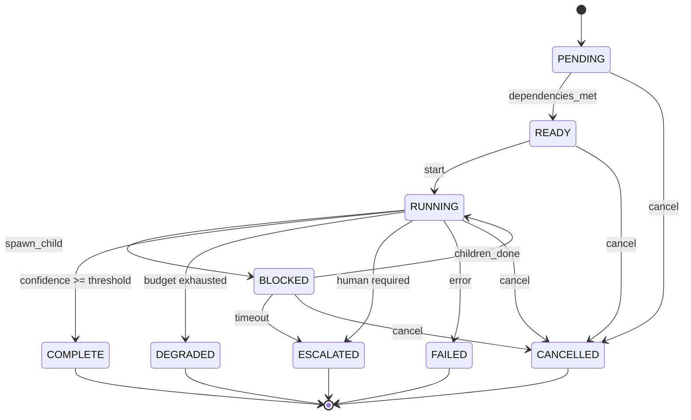
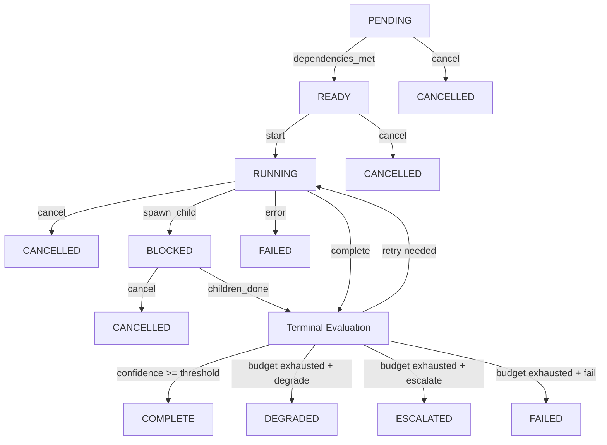
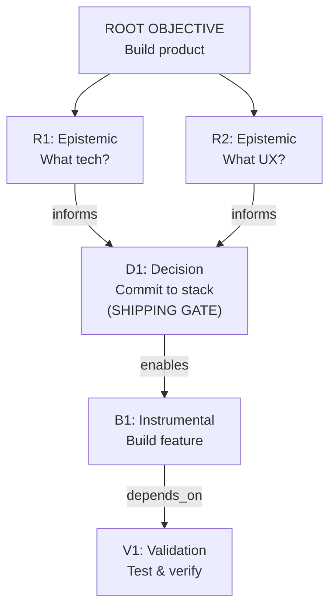
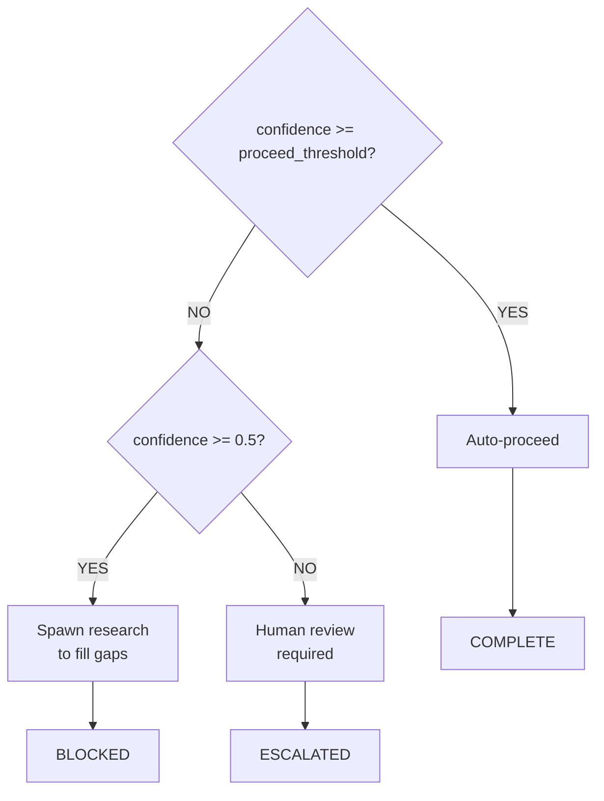
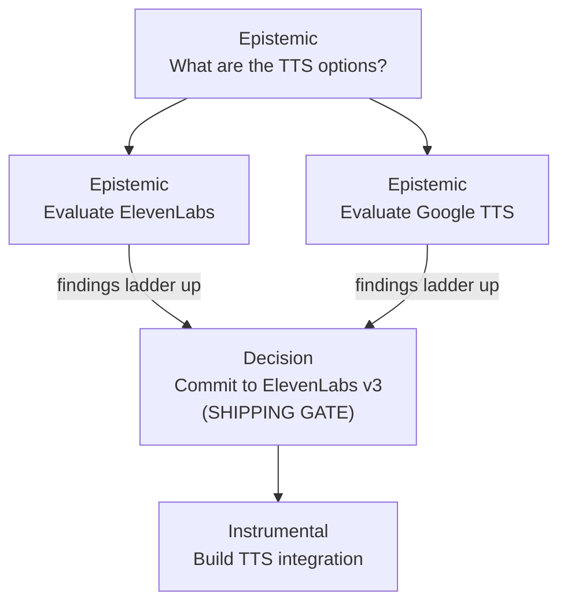

# GOTN Architecture

## Overview

Goal-Oriented Task Network (GOTN) is a recursive workflow orchestration model that unifies knowledge acquisition and artifact production under a single abstraction: the **WorkNode**.

## The Core Problem

Traditional workflow systems face a tension:

| Approach | Strength | Weakness |
|----------|----------|----------|
| **Question-driven** | Good for research/discovery | Doesn't encode outcomes; can spiral infinitely |
| **Objective-driven** | Good for delivery | Assumes you know what to build; brittle to unknowns |

Real-world projects require both: you need to **learn** things to **build** things, and building reveals what you still need to learn.

## The Solution: Unified WorkNode

GOTN resolves this by recognizing that questions and objectives are the same thing at different abstraction levels:

```
"What TTS provider should we use?"
    ↓ reframe as objective
"Determine optimal TTS provider for children's narration"
    ↓ with success criteria
"Achieve ≥0.8 confidence in TTS selection based on quality, cost, and API availability"
```

Both are **goals with acceptance criteria**. The only difference is what they produce:
- Questions produce **knowledge** (findings, claims)
- Build tasks produce **artifacts** (code, content, configs)
- Decisions produce **commitments** (binding choices with rationale)

## Three-Layer Architecture



## Self-Similar Pattern

Every WorkNode, regardless of mode, follows the same lifecycle:



**Self-similarity**: A child WorkNode has the exact same structure. "Research TTS options" spawns "Evaluate ElevenLabs v3" which spawns "Test emotive tag performance"—each following the same cycle.

## State Machine Specification

### Formal State Diagram



### State Definitions

| State | Description | Invariants |
|-------|-------------|------------|
| `pending` | Node created but dependencies not yet satisfied | `edges.filter(depends_on).some(e => !e.target.complete)` |
| `ready` | All dependencies satisfied, awaiting execution slot | All `depends_on` targets are `complete` or `degraded` |
| `running` | Actively executing work | Has execution context, consuming budget |
| `blocked` | Spawned children, awaiting their completion | `children.length > 0 && children.some(c => !c.terminal)` |
| `complete` | Successfully finished with full deliverable | `confidence.aggregate >= autonomy_gate.proceed_threshold` |
| `degraded` | Budget exhausted, minimal viable output produced | `budget.exhausted && outputs.length > 0` |
| `escalated` | Human intervention required | Awaiting external resolution |
| `failed` | Unrecoverable error, no usable output | `error != null` |
| `cancelled` | Terminated by parent or external signal | Parent achieved threshold or explicit cancel |

### Transition Events

| Event | Source States | Target State | Guard Conditions |
|-------|---------------|--------------|------------------|
| `dependencies_met` | pending | ready | All `depends_on` edges point to terminal nodes |
| `start` | ready | running | Execution slot available, within `MAX_CONCURRENT_NODES` |
| `spawn_child` | running | blocked | Child node created for delegation |
| `children_done` | blocked | running | All children in terminal state (`complete`, `degraded`, `failed`, `cancelled`) |
| `complete` | running | complete | `confidence.aggregate >= proceed_threshold` |
| `degrade` | running | degraded | `budget.exhausted && exit_policy.on_budget_exhausted == 'degrade'` |
| `escalate` | running, blocked | escalated | Escalation trigger matched OR `exit_policy.on_budget_exhausted == 'escalate'` |
| `error` | running, blocked | failed | Unrecoverable error occurred |
| `cancel` | pending, ready, running, blocked | cancelled | Parent cancelled OR sibling satisfied parent threshold |

### Event-Driven Resolution

The scheduler uses a pub/sub model for efficient state transitions:

```python
class NodeEventBus:
    """Event-driven node state coordination."""

    def __init__(self):
        self.subscribers: dict[str, list[Callable]] = defaultdict(list)

    def subscribe(self, node_id: str, callback: Callable[[NodeEvent], None]):
        """Subscribe to events from a specific node."""
        self.subscribers[node_id].append(callback)

    def publish(self, event: NodeEvent):
        """Publish event and notify all subscribers."""
        for callback in self.subscribers[event.source_id]:
            callback(event)

    def on_node_terminal(self, node: WorkNode):
        """Called when a node reaches a terminal state."""
        event = NodeEvent(
            type='terminal',
            source_id=node.id,
            status=node.status,
            outputs=node.outputs
        )
        self.publish(event)

        # Check if parent can unblock
        if node.parent:
            parent = get_node(node.parent)
            if parent.status == 'blocked':
                if all(c.status in TERMINAL_STATES for c in parent.children):
                    self.transition(parent, 'children_done')
```

### Concurrent State Transitions

When multiple events arrive simultaneously:

```python
def handle_concurrent_events(node: WorkNode, events: list[NodeEvent]) -> str:
    """Resolve concurrent events with priority ordering."""

    # Priority: cancel > error > escalate > complete > other
    PRIORITY = {
        'cancel': 0,
        'error': 1,
        'escalate': 2,
        'complete': 3,
        'degrade': 4,
        'children_done': 5,
    }

    # Sort by priority (lowest number = highest priority)
    events.sort(key=lambda e: PRIORITY.get(e.type, 99))

    # Apply highest priority event
    return apply_transition(node, events[0])
```

### Blocked Resolution Semantics

When a node enters `blocked` state:

1. **Child Monitoring**: Subscribe to `terminal` events from all children
2. **Timeout Handling**: If `budget.time_ms` expires while blocked, evaluate `exit_policy.on_blocked`
3. **Partial Success**: If some children complete and confidence threshold met, cancel remaining children
4. **All Children Failed**: Transition to `failed` or `escalated` based on `exit_policy`

```python
def resolve_blocked(node: WorkNode) -> str:
    """Determine next state when all children are terminal."""

    successful = [c for c in node.children if c.status in ('complete', 'degraded')]
    failed = [c for c in node.children if c.status == 'failed']

    # Aggregate evidence from successful children
    for child in successful:
        propagate_evidence(child, node)

    # Re-evaluate confidence
    new_confidence = aggregate_confidence(node)

    if new_confidence >= node.autonomy_gate.proceed_threshold:
        return 'complete'

    if len(failed) == len(node.children):
        # All children failed
        if node.exit_policy.on_blocked == 'escalate':
            return 'escalated'
        return 'failed'

    if node.budget.exhausted:
        return node.exit_policy.on_budget_exhausted  # 'degrade' | 'escalate' | 'fail'

    # Can retry with different approach
    return 'running'
```

## The DAG Structure

WorkNodes form a Directed Acyclic Graph with typed edges:

| Edge Type | Meaning | Blocking? |
|-----------|---------|-----------|
| `depends_on` | Must complete before I can start | Yes |
| `informs` | Findings are useful but not required | No |
| `blocks` | Risk that could halt progress | Conditional |
| `enables` | Completion unlocks new possibilities | No |



### Edge Type Semantics

#### `depends_on` (Hard Prerequisite)

**Behavior**: Target node must reach a terminal state (`complete` or `degraded`) before source can transition from `pending` to `ready`.

```python
def can_start(node: WorkNode) -> bool:
    for edge in node.edges:
        if edge.type == 'depends_on':
            target = get_node(edge.target)
            if target.status not in ('complete', 'degraded'):
                return False
    return True
```

**Deadlock Prevention**: The system validates that adding a `depends_on` edge does not create a cycle. If A depends_on B and B depends_on A (directly or transitively), the edge addition is rejected.

#### `blocks` (Risk Relationship)

**Behavior**: Represents a risk that could halt progress. Unlike `depends_on`, a `blocks` edge does not prevent the source from starting, but:
1. The scheduler monitors the blocking node
2. If the blocker enters `failed` or `escalated` state, the blocked node receives a `risk_triggered` event
3. The blocked node must then evaluate whether to continue, degrade, or escalate

```python
def on_blocker_failed(blocked: WorkNode, blocker: WorkNode) -> None:
    """Called when a node we're watching for risks fails."""
    risk_assessment = evaluate_risk_impact(blocked, blocker)

    if risk_assessment.severity == 'critical':
        blocked.status = 'escalated'
        blocked.escalation_context = EscalationContext(
            reason=f"Blocker {blocker.id} failed",
            options=[
                EscalationOption(action='proceed', description='Continue despite risk'),
                EscalationOption(action='abort', description='Stop and fail'),
                EscalationOption(action='mitigate', description='Spawn mitigation'),
            ]
        )
    elif risk_assessment.severity == 'major':
        # Spawn mitigation research if VOI positive
        if should_spawn_research(blocked, risk_assessment.mitigation_question):
            spawn_child(blocked, risk_assessment.mitigation_question)
    # Minor risks: log and continue
```

**Deadlock Prevention**: `blocks` edges are included in cycle detection alongside `depends_on`. A mutual blocking relationship (A blocks B and B blocks A) is rejected.

**Resolution Timeout**: If a blocker remains in `running` or `blocked` state beyond the blocked node's deadline, the blocked node may proceed with degraded confidence or escalate.

#### `informs` (Soft Prerequisite)

**Behavior**: Findings from the target are useful but not required. The scheduler may:
1. Wait opportunistically if the informer is close to completion
2. Proceed immediately if the informer is far from completion
3. Integrate findings retroactively if they arrive during execution

```python
def evaluate_inform_wait(source: WorkNode, informer: WorkNode) -> WaitDecision:
    """Decide whether to wait for an informer."""
    informer_progress = estimate_completion_time(informer)
    source_deadline_pressure = get_deadline_factor(source)

    # Wait if informer is almost done and we have time
    if informer_progress.eta_minutes < 5 and source_deadline_pressure > 0.5:
        return WaitDecision.WAIT_BRIEFLY

    # Don't wait if under deadline pressure
    if source_deadline_pressure < 0.3:
        return WaitDecision.PROCEED_NOW

    return WaitDecision.PROCEED_WITH_CALLBACK
```

**No Deadlock Risk**: `informs` edges are non-blocking and excluded from cycle detection.

#### `enables` (Unlock Relationship)

**Behavior**: Completion of the source unlocks new possibilities for the target. The target node transitions from `pending` to `ready` when enabled.

```python
def on_enabler_complete(target: WorkNode, enabler: WorkNode) -> None:
    """Called when an enabling node completes."""
    # Check if target was waiting for this enabler
    if target.status == 'pending':
        # Mark this enabler as satisfied
        target.satisfied_enablers.add(enabler.id)

        # Check if all required enablers are satisfied
        required = [e for e in target.edges if e.type == 'enabled_by']
        if all(e.target in target.satisfied_enablers for e in required):
            target.status = 'ready'
```

**No Deadlock Risk**: `enables` edges represent possibility expansion, not blocking constraints.

#### `spawned_by` (Parent-Child Relationship)

**Behavior**: Indicates that the source node was created by the target to handle delegated work. Used for:
1. Propagating cancellation (if parent cancels, children are cancelled)
2. Aggregating evidence (child claims ladder up to parent)
3. Budget accounting (child consumption counts against parent budget)

```python
def on_parent_cancelled(child: WorkNode, parent: WorkNode) -> None:
    """Cascade cancellation to children."""
    if child.status in ('pending', 'ready', 'running', 'blocked'):
        child.status = 'cancelled'
        # Recursively cancel grandchildren
        for grandchild_ref in child.children:
            grandchild = get_node(grandchild_ref)
            on_parent_cancelled(grandchild, child)
```

#### `supersedes` (Replacement Relationship)

**Behavior**: The source node replaces or obsoletes the target node. When a superseding edge is created:

1. The superseded node is marked for cancellation (if still running)
2. Any nodes that `depends_on` the superseded node are updated to depend on the superseding node
3. Evidence from the superseded node may be migrated if still valid

```python
def supersede_node(new_node: WorkNode, old_node: WorkNode) -> None:
    """Replace old_node with new_node in the graph."""

    # Cancel old node if still active
    if old_node.status in ('pending', 'ready', 'running', 'blocked'):
        old_node.status = 'cancelled'

    # Migrate dependencies: anything that depended on old now depends on new
    for node in get_all_nodes():
        for edge in node.edges:
            if edge.target == old_node.id and edge.type == 'depends_on':
                edge.target = new_node.id
                log_info(f"Migrated dependency: {node.id} now depends on {new_node.id}")

    # Preserve valid outputs from superseded node
    if old_node.outputs:
        for output in old_node.outputs:
            if is_output_still_valid(output, new_node.goal):
                new_node.inherited_outputs.append(output)

    # Add supersedes edge for auditability
    new_node.edges.append(TypedEdge(target=old_node.id, type='supersedes'))
```

**Use Cases**:
- Retrying a failed node with different parameters
- Replacing outdated research with fresh investigation
- Upgrading a decision based on new evidence

**Deadlock Prevention**: Supersedes edges do not participate in cycle detection since they represent historical relationships, not active blocking constraints.

## Node Modes

### Epistemic Mode (Research)

**Purpose**: Acquire knowledge to reduce uncertainty

```yaml
mode: epistemic
goal: "Determine optimal TTS provider"
deliverable_type: knowledge
outputs:
  - claims: [{proposition, evidence, confidence, expiry}]
  - findings: [{source, summary, relevance}]
```

### Instrumental Mode (Build)

**Purpose**: Produce artifacts

```yaml
mode: instrumental
goal: "Build TTS pipeline"
deliverable_type: artifact
outputs:
  - artifacts: [{path, type, hash, metadata}]
```

### Decision Mode (Commit)

**Purpose**: Make binding choices that downstream work depends on

```yaml
mode: decision
goal: "Commit to ElevenLabs v3 as TTS provider"
deliverable_type: commitment
outputs:
  - commitment:
      choice_set: [ElevenLabs, Google, Amazon]
      selected: ElevenLabs
      rationale: "Best emotive quality, acceptable cost"
      residual_risks: ["Rate limits at scale"]
      rollback_plan: "Abstract TTS interface allows swap"
```

## Confidence Model

### Per-Criterion Confidence

Each acceptance criterion has its own confidence score:

```yaml
acceptance_criteria:
  - id: quality
    description: "TTS output sounds natural"
    confidence: 0.85
    evidence: [exp-001, exp-002]
  - id: cost
    description: "Cost < $0.01 per minute"
    confidence: 0.95
    evidence: [pricing-doc]
  - id: api_stability
    description: "API is stable and well-documented"
    confidence: 0.70
    evidence: [docs-review]
```

### Aggregation Strategy

```python
def aggregate_confidence(node):
    must_pass = node.autonomy_gate.must_pass_criteria
    must_pass_scores = [node.confidence.by_criterion[c] for c in must_pass]
    other_scores = [v for k, v in node.confidence.by_criterion.items()
                    if k not in must_pass]

    # Safety-critical: use minimum of must-pass
    must_pass_min = min(must_pass_scores) if must_pass_scores else 1.0

    # Others: weighted mean
    other_mean = weighted_mean(other_scores) if other_scores else 1.0

    # Risk flags can force lower aggregate
    if 'safety' in node.autonomy_gate.risk_flags:
        return min(must_pass_min, other_mean)

    return (must_pass_min * 0.6) + (other_mean * 0.4)
```

## Autonomy Decisions



### Autonomy Gate Configuration

```yaml
autonomy_gate:
  proceed_threshold: 0.8      # Auto-proceed above this
  must_pass_criteria: [safety, appropriateness]
  risk_flags: [safety]        # Forces stricter evaluation
  human_required: false       # Override to always require human
  escalation_triggers:
    - "cost exceeds $100"
    - "affects production data"
```

## Shipping Gates

**Problem**: Epistemic nodes could research forever without producing anything.

**Solution**: Every research branch must terminate in a **Decision node** (shipping gate) that explicitly commits to stop learning and start building.



**Rule**: A research node without a downstream Decision node is flagged for review. Why are we learning this if we're not going to commit to something?

## VOI Gating (Value of Information)

Before spawning a child research node:

```python
def should_spawn_research(parent, question):
    voi = estimate_value_of_information(question, parent.goal)
    cost = estimate_research_cost(question)

    # Deadline pressure
    if parent.goal.deadline:
        time_remaining = parent.goal.deadline - now()
        deadline_factor = time_remaining / parent.budget.time
    else:
        deadline_factor = 1.0

    # Don't research if VOI < cost or deadline too close
    if voi < cost or deadline_factor < 0.2:
        return False

    return True
```

## Exit Policies

Every node defines what happens when it can't complete normally:

```yaml
exit_policy:
  on_success: complete          # Normal completion
  on_budget_exhausted: degrade  # Produce minimal viable output
  on_blocked: spawn_child       # Create child to resolve blocker
  degradation_output: "Use ElevenLabs v3 as default (known working)"
```

### Exit States

| State | Meaning |
|-------|---------|
| `complete` | All criteria met, deliverable produced |
| `degraded` | Budget exhausted, minimal viable output produced |
| `escalated` | Human intervention required |
| `failed` | Unrecoverable error, no output |

## Global Circuit Breakers

Prevent runaway recursion:

```python
GLOBAL_LIMITS = {
    'MAX_DEPTH': 5,              # Maximum nesting level
    'MAX_NODES_PER_ROOT': 200,   # Maximum nodes in one tree
    'MAX_EPISTEMIC_RATIO': 0.4,  # No more than 40% research nodes
    'CYCLE_DETECTION': True,     # Runtime DAG validation
}
```

## Performance Optimizations

### Semantic Caching

Cache research findings to avoid redundant work:

```python
# Key: hash of goal + context
cache_key = hash(goal.statement + context_fingerprint)

# Before spawning research
if cache.has(cache_key) and not cache.expired(cache_key):
    return cache.get(cache_key)  # Return cached claims
```

### Cascading Cancellation

When a parent achieves sufficient confidence from one child, cancel sibling research:

```python
def on_child_complete(parent, child):
    new_confidence = aggregate_confidence(parent)
    if new_confidence >= parent.autonomy_gate.proceed_threshold:
        for sibling in parent.children:
            if sibling.mode == 'epistemic' and sibling.status == 'running':
                sibling.cancel()  # No longer needed
```

### Context Window Management

Completed nodes collapse to summaries:

```python
def collapse_node(node):
    return {
        'id': node.id,
        'status': 'complete',
        'deliverable': node.outputs[-1],  # Just the final output
        'confidence': node.confidence.aggregate,
        # Internal trace is NOT passed to parent
    }
```

## Implementation Checklist

1. [ ] Define WorkNode schema (TypeScript/Python interface)
2. [ ] Implement node state machine (pending → complete)
3. [ ] Build DAG manager with cycle detection
4. [ ] Implement confidence aggregation
5. [ ] Build autonomy decision engine
6. [ ] Add shipping gate enforcement
7. [ ] Implement VOI gating
8. [ ] Add global circuit breakers
9. [ ] Build semantic cache
10. [ ] Create CLI orchestrator
11. [ ] Add HITL notification system

## References

- **HTN Planning**: Erol, Hendler, Nau (1994) - Hierarchical Task Network Planning
- **BDI Architecture**: Rao & Georgeff (1995) - Belief-Desire-Intention model
- **OODA Loop**: Boyd (1987) - Observe-Orient-Decide-Act
- **Goal Trees**: Dardenne, van Lamsweerde, Fickas (1993) - Goal-directed requirements acquisition
