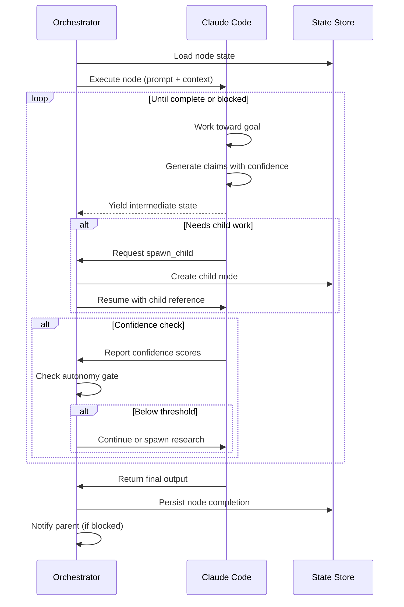

# LLM Integration Architecture

## Overview

GOTN uses LLMs (Claude) as the **execution engine** for WorkNodes, with a lightweight orchestration layer managing state, persistence, and control flow.

```mermaid
flowchart TB
    subgraph Orchestrator["Orchestrator (Python/Shell)"]
        CLI["gotn CLI"]
        StateManager["State Manager"]
        Scheduler["Scheduler"]
        Cache["Semantic Cache"]
        CircuitBreaker["Circuit Breakers"]
    end

    subgraph Execution["LLM Execution (Claude Code)"]
        NodeRunner["Node Runner"]
        ClaimExtractor["Claim Extractor"]
        ConfidenceEstimator["Confidence Estimator"]
        ChildSpawner["Child Spawner"]
    end

    subgraph Persistence["Persistence Layer"]
        NodeStore["nodes/*.yaml"]
        EvidenceStore["evidence/*.yaml"]
        CacheStore["cache/semantic.db"]
    end

    CLI --> StateManager
    StateManager --> Scheduler
    Scheduler --> NodeRunner
    NodeRunner --> ClaimExtractor
    NodeRunner --> ConfidenceEstimator
    NodeRunner --> ChildSpawner
    ChildSpawner --> Scheduler

    StateManager --> NodeStore
    ClaimExtractor --> EvidenceStore
    Cache --> CacheStore
    CircuitBreaker --> StateManager
```



## Execution Model

### Node Execution Flow

When a WorkNode is ready to execute:



### Claude Code as Executor

Each node mode maps to a specific Claude execution pattern:

| Mode | Claude Role | Primary Actions |
|------|-------------|-----------------|
| **Epistemic** | Researcher | Web search, file reading, analysis, claim generation |
| **Instrumental** | Builder | Code writing, file creation, tool execution |
| **Decision** | Analyst | Option evaluation, trade-off analysis, commitment |
| **Validation** | Tester | Verification, testing, issue identification |

## Prompt Structure

### Node Execution Prompt

```markdown
# WorkNode Execution

## Goal
{{goal.statement}}

## Acceptance Criteria
{{#each goal.acceptance_criteria}}
- [ ] {{description}} (type: {{type}}, must_pass: {{must_pass}})
{{/each}}

## Context
- Mode: {{mode}}
- Depth: {{depth}} / {{max_depth}}
- Budget: {{budget.tokens}} tokens, {{budget.time_ms}}ms
- Parent goal: {{parent.goal.statement}}

## Available Evidence
{{#each evidence}}
- [{{id}}] {{summary}} (strength: {{strength}}, recency: {{recency}})
{{/each}}

## Instructions

1. Work toward the goal, generating claims with confidence scores
2. For each claim, cite evidence using [evidence-id] format
3. Report confidence per criterion as you progress
4. If you need information you don't have, request a child node
5. Stop when: confidence >= {{autonomy_gate.proceed_threshold}} OR budget exhausted

## Output Format

Return a structured response:
- claims: [{proposition, confidence, evidence_ids, domain}]
- criterion_status: [{id, satisfied, confidence}]
- needs_children: [{goal, mode, rationale}] (if blocked)
- output: {type, content} (if complete)
```

### Confidence Calibration Prompt

```markdown
## Confidence Calibration

For each claim, estimate confidence using this scale:
- 0.9-1.0: Verified fact with strong evidence
- 0.7-0.9: High confidence, multiple supporting sources
- 0.5-0.7: Moderate confidence, some uncertainty
- 0.3-0.5: Low confidence, limited evidence
- 0.0-0.3: Speculation or single weak source

Consider:
- Evidence recency (older = lower confidence)
- Source reliability
- Contradicting information
- Domain expertise required
```

## Utility Architecture

### Directory Structure

```
gotn/
├── bin/                      # CLI entry points
│   └── gotn                  # Main CLI
├── lib/                      # Core Python modules
│   ├── __init__.py
│   ├── node.py               # WorkNode dataclass + operations
│   ├── state.py              # State machine implementation
│   ├── scheduler.py          # DAG scheduling + concurrency
│   ├── cache.py              # Semantic cache
│   ├── confidence.py         # Confidence aggregation
│   ├── circuit_breaker.py    # Global limits enforcement
│   └── executor.py           # Claude Code integration
├── prompts/                  # Prompt templates
│   ├── epistemic.md
│   ├── instrumental.md
│   ├── decision.md
│   └── validation.md
├── store/                    # Runtime data (gitignored)
│   ├── nodes/                # Node YAML files
│   ├── evidence/             # Evidence items
│   ├── cache/                # Semantic cache DB
│   └── runs/                 # Execution logs
└── skills/                   # Claude Code skills
    ├── gotn-run.md           # /gotn-run skill
    ├── gotn-status.md        # /gotn-status skill
    └── gotn-spawn.md         # /gotn-spawn skill
```

### Core Utilities

#### 1. `gotn` CLI

```bash
# Initialize a new goal tree
gotn init "Build a TTS pipeline for children's stories"

# Run the next ready node
gotn run

# Run continuously until blocked or complete
gotn run --continuous

# Check status
gotn status
gotn status --tree  # Show full DAG

# Spawn a child node manually
gotn spawn <parent-id> --mode epistemic --goal "Research TTS providers"

# Resume after HITL
gotn resume <node-id> --decision "proceed"

# Export the goal tree
gotn export --format yaml|json|mermaid
```

#### 2. State Manager (`lib/state.py`)

```python
class StateManager:
    """Manages WorkNode persistence and state transitions."""

    def __init__(self, store_path: Path):
        self.store_path = store_path
        self.nodes: dict[str, WorkNode] = {}

    def load_node(self, node_id: str) -> WorkNode:
        """Load node from YAML store."""
        path = self.store_path / "nodes" / f"{node_id}.yaml"
        return WorkNode.from_yaml(path.read_text())

    def save_node(self, node: WorkNode) -> None:
        """Persist node to YAML store."""
        path = self.store_path / "nodes" / f"{node.id}.yaml"
        path.write_text(node.to_yaml())

    def transition(self, node: WorkNode, event: str) -> WorkNode:
        """Apply state transition with validation."""
        new_status = STATE_MACHINE.transition(node.status, event)
        node.status = new_status
        node.updated_at = now()
        self.save_node(node)
        return node

    def get_ready_nodes(self) -> list[WorkNode]:
        """Find all nodes ready for execution."""
        return [n for n in self.nodes.values()
                if n.status == 'ready']

    def get_blocked_parents(self, node: WorkNode) -> list[WorkNode]:
        """Find parents waiting on this node."""
        return [n for n in self.nodes.values()
                if n.status == 'blocked' and node.id in n.children]
```

#### 3. Claude Executor (`lib/executor.py`)

```python
class ClaudeExecutor:
    """Executes WorkNodes via Claude Code."""

    def __init__(self, prompt_dir: Path):
        self.prompts = self._load_prompts(prompt_dir)

    def execute_node(self, node: WorkNode, context: ExecutionContext) -> NodeResult:
        """Execute a single node using Claude."""

        # Build prompt from template
        prompt = self._build_prompt(node, context)

        # Execute via Claude Code subprocess
        result = self._run_claude(prompt, node.budget)

        # Parse structured output
        return self._parse_result(result, node)

    def _run_claude(self, prompt: str, budget: Budget) -> str:
        """Run Claude Code with budget constraints."""
        cmd = [
            "claude", "--print", "--dangerously-skip-permissions",
            "--max-turns", str(budget.steps or 10),
            prompt
        ]
        result = subprocess.run(cmd, capture_output=True, timeout=budget.time_ms / 1000)
        return result.stdout.decode()

    def _parse_result(self, output: str, node: WorkNode) -> NodeResult:
        """Extract claims, confidence, and outputs from Claude response."""
        # Parse YAML/JSON blocks from output
        claims = self._extract_claims(output)
        criterion_status = self._extract_criteria(output)
        child_requests = self._extract_spawn_requests(output)
        final_output = self._extract_output(output)

        return NodeResult(
            claims=claims,
            criterion_status=criterion_status,
            child_requests=child_requests,
            output=final_output
        )
```

#### 4. Scheduler (`lib/scheduler.py`)

```python
class Scheduler:
    """Manages node execution order and concurrency."""

    def __init__(self, state: StateManager, max_concurrent: int = 10):
        self.state = state
        self.max_concurrent = max_concurrent
        self.running: set[str] = set()

    def get_next_node(self) -> Optional[WorkNode]:
        """Get highest priority ready node."""
        ready = self.state.get_ready_nodes()
        if not ready:
            return None

        # Priority: decision > instrumental > validation > epistemic
        ready.sort(key=lambda n: self._priority(n))
        return ready[0]

    def on_node_complete(self, node: WorkNode) -> list[WorkNode]:
        """Handle node completion, unblock parents."""
        self.running.discard(node.id)

        # Check if any blocked parents can resume
        unblocked = []
        for parent in self.state.get_blocked_parents(node):
            if self._all_children_terminal(parent):
                self.state.transition(parent, 'children_done')
                unblocked.append(parent)

        return unblocked

    def run_continuous(self, executor: ClaudeExecutor) -> None:
        """Run nodes until no more ready or blocked on HITL."""
        while True:
            node = self.get_next_node()
            if not node:
                break

            self.state.transition(node, 'start')
            self.running.add(node.id)

            result = executor.execute_node(node, self._build_context(node))
            self._apply_result(node, result)

            if node.status == 'escalated':
                print(f"HITL required for {node.id}: {node.escalation_context.reason}")
                break
```

### Claude Code Skills

#### `/gotn-run` Skill

```markdown
# /gotn-run Skill

Execute the next ready GOTN WorkNode.

## Invocation
/gotn-run [--continuous] [--node-id <id>]

## Behavior

1. Load the goal tree from `store/nodes/`
2. Find the highest priority ready node
3. Build execution prompt from node spec
4. Execute using Claude's capabilities:
   - Epistemic: Use WebSearch, Read, Task tools
   - Instrumental: Use Write, Edit, Bash tools
   - Decision: Analyze options, produce commitment
   - Validation: Run tests, verify outputs
5. Parse results and update node state
6. Check for child spawn requests
7. Evaluate confidence and autonomy gate
8. Persist updated state

## Output
Returns execution summary with:
- Node ID and goal
- Claims generated
- Confidence scores
- Status transition
- Child nodes spawned (if any)
```

#### `/gotn-spawn` Skill

```markdown
# /gotn-spawn Skill

Spawn a child WorkNode under an existing node.

## Invocation
/gotn-spawn <parent-id> --mode <mode> --goal "<goal>"

## Behavior

1. Validate parent exists and is in running/blocked state
2. Check global limits (MAX_DEPTH, MAX_NODES, MAX_EPISTEMIC_RATIO)
3. Create child node with:
   - Inherited budget (fraction of parent)
   - Parent reference
   - production_anchor (from parent or inherited)
4. Add spawned_by edge
5. Transition parent to blocked if not already
6. Persist both nodes

## VOI Check
Before spawning epistemic nodes, evaluate:
- Estimated value of information
- Cost (tokens, time)
- Deadline pressure
Reject spawn if VOI < cost.
```

## Integration Points

### 1. Hook into Claude Code

Add to `.claude/skills/gotn-run.md`:

```markdown
# /gotn-run

Run the next GOTN WorkNode. This skill executes goal-oriented tasks
with confidence tracking and automatic child spawning.

## Usage
Just say "/gotn-run" to execute the next ready node, or
"/gotn-run --continuous" to run until blocked or complete.
```

### 2. HITL via Claude Code

When a node escalates:

```python
def handle_escalation(node: WorkNode) -> None:
    """Present escalation to user via Claude Code."""
    ctx = node.escalation_context

    question = f"""
## Human Decision Required

**Node**: {node.id}
**Goal**: {node.goal.statement}
**Reason**: {ctx.reason}

### Options
{format_options(ctx.options)}

### Flagged Content
{format_flagged(ctx.flagged_content)}

What would you like to do?
"""
    # This gets shown to user in Claude Code interface
    print(question)
```

### 3. Evidence from Tools

Map Claude tool outputs to Evidence:

| Tool | Evidence Type | Strength Heuristic |
|------|--------------|-------------------|
| WebSearch | research | 0.6-0.8 based on source |
| WebFetch | documentation | 0.7-0.9 based on domain |
| Read (code) | documentation | 0.9 (primary source) |
| Bash (tests) | validation | 0.95 if passes |
| Task (subagent) | expert | 0.7-0.85 |

### 4. State Persistence Format

`store/nodes/<id>.yaml`:

```yaml
id: tts-research-001
depth: 1
mode: epistemic
status: complete

goal:
  statement: "Determine TTS providers suitable for children's narration"
  acceptance_criteria:
    - id: options_identified
      description: "At least 3 viable providers identified"
      type: knowledge
      satisfied: true
      confidence: 0.92

claims:
  - id: claim-001
    proposition: "ElevenLabs v3 has best emotive quality"
    confidence: 0.85
    evidence_ids: [ev-001, ev-002]
    domain: api_documentation

evidence:
  - id: ev-001
    type: research
    source: "https://elevenlabs.io/docs"
    summary: "Supports SSML emotion tags"
    strength: 0.8
    recency: "2026-01-11"

confidence:
  aggregate: 0.88
  by_criterion:
    options_identified: 0.92
    quality_assessed: 0.85
  aggregation_method: weighted_mean

resource_usage:
  tokens: 12500
  time_ms: 45000
  cost_dollars: 0.15
```

## Next Steps

1. **Implement core utilities** - `lib/*.py` modules
2. **Create prompt templates** - Mode-specific prompts in `prompts/`
3. **Build CLI** - `bin/gotn` with Click/Typer
4. **Add Claude Code skills** - `/gotn-run`, `/gotn-spawn`, `/gotn-status`
5. **Implement semantic cache** - SQLite + embeddings
6. **Add HITL flow** - Escalation handling in Claude Code
