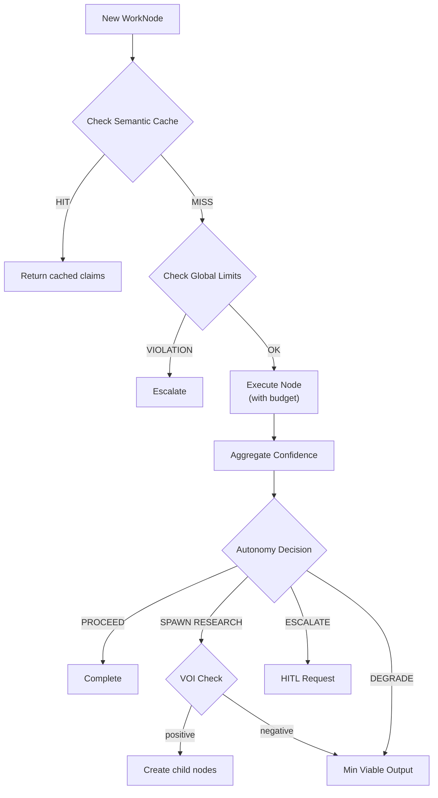

# GOTN Control Mechanisms

## Overview

GOTN uses several control mechanisms to ensure workflows:
1. Make progress toward delivery (don't spiral)
2. Maintain quality through confidence gating
3. Surface genuinely uncertain decisions to humans
4. Stay within resource bounds

## 1. Shipping Gates

### Problem
Epistemic (research) nodes can spawn indefinitely without producing deliverables.

### Solution
Every research branch must terminate in a **Decision node** that explicitly commits.

```
[Epistemic] → [Epistemic] → [Decision] → [Instrumental]
     ↓             ↓            ↑
   spawn         spawn      SHIPPING GATE
                            (commitment required)
```

### Implementation

```python
def validate_shipping_gate(node: WorkNode) -> bool:
    """Ensure research branches have delivery endpoints."""
    if node.mode != 'epistemic':
        return True

    # Find all downstream nodes
    downstream = get_all_downstream(node)

    # At least one must be a decision or instrumental node
    has_shipping_gate = any(
        d.mode in ('decision', 'instrumental')
        for d in downstream
    )

    if not has_shipping_gate:
        flag_for_review(node, "Research without shipping gate")
        return False

    return True
```

### Enforcement

When creating an epistemic node, require either:
- An existing downstream decision/instrumental node, OR
- A `production_anchor` field specifying what this research enables

```yaml
# Valid: has production anchor
id: research-tts-options
mode: epistemic
production_anchor: build-tts-pipeline  # What this enables
```

## 2. VOI Gating (Value of Information)

### Problem
Not all research is worth doing. Some questions have low value relative to their cost.

### Solution
Before spawning research, estimate if the expected value exceeds the cost.

### Algorithm

```python
def should_spawn_research(
    parent: WorkNode,
    question: str,
    context: Context
) -> tuple[bool, str]:
    """Decide whether to spawn a research node."""

    # Estimate value: How much would answering this improve parent confidence?
    current_confidence = parent.confidence.aggregate
    potential_improvement = estimate_confidence_gain(question, parent)
    value = potential_improvement * parent_importance(parent)

    # Estimate cost: Time, tokens, dollars
    cost = estimate_research_cost(question, context)

    # Check deadline pressure
    if parent.goal.deadline:
        time_remaining = parent.goal.deadline.timestamp - now()
        deadline_factor = time_remaining / parent.budget.time_ms
    else:
        deadline_factor = 1.0

    # Decision logic
    if deadline_factor < 0.2:
        return False, "Deadline too close, proceed with current knowledge"

    if value < cost:
        return False, f"VOI ({value:.2f}) < cost ({cost:.2f})"

    if current_confidence >= parent.autonomy_gate.proceed_threshold:
        return False, "Already have sufficient confidence"

    return True, "Research justified"
```

### VOI Estimation Heuristics

| Factor | High VOI | Low VOI |
|--------|----------|---------|
| Current confidence | Low (0.3-0.5) | High (>0.8) |
| Criterion importance | Must-pass | Nice-to-have |
| Question specificity | Precise question | Vague exploration |
| Available sources | Known good sources | Uncertain availability |

## 3. Confidence Aggregation

### Problem
Multiple criteria with different confidences need to combine into a single autonomy decision.

### Algorithm

```python
def aggregate_confidence(node: WorkNode) -> float:
    """Compute aggregate confidence from per-criterion scores."""

    must_pass = node.autonomy_gate.must_pass_criteria
    all_criteria = node.goal.acceptance_criteria

    # Separate must-pass from optional criteria
    must_pass_scores = [
        c.confidence for c in all_criteria
        if c.id in must_pass
    ]
    optional_scores = [
        c.confidence for c in all_criteria
        if c.id not in must_pass
    ]

    # Must-pass: use minimum (any failure is critical)
    must_pass_min = min(must_pass_scores) if must_pass_scores else 1.0

    # Optional: weighted mean
    optional_mean = weighted_mean(optional_scores) if optional_scores else 1.0

    # Risk flags can force stricter aggregation
    if 'safety' in node.autonomy_gate.risk_flags:
        # Safety-critical: be conservative
        return min(must_pass_min, optional_mean * 0.9)

    # Normal: weighted combination
    return (must_pass_min * 0.7) + (optional_mean * 0.3)
```

### Confidence Decay

Claims and evidence lose confidence over time:

```python
def apply_recency_decay(claim: Claim) -> float:
    """Reduce confidence based on age."""
    age_days = (now() - claim.evidence_recency).days

    # Domain-specific decay rates
    decay_rates = {
        'api_documentation': 90,   # Stale after 90 days
        'academic_research': 730,  # Stale after 2 years
        'market_data': 30,         # Stale after 30 days
        'experiment_result': 180,  # Stale after 6 months
    }

    half_life = decay_rates.get(claim.domain, 180)
    decay_factor = 0.5 ** (age_days / half_life)

    return claim.confidence * decay_factor
```

## 4. Autonomy Decision Engine

### Problem
Determine when to auto-proceed, spawn research, or escalate to humans.

### Algorithm

```python
def evaluate_autonomy(node: WorkNode) -> AutonomyDecision:
    """Decide next action based on confidence and context."""

    confidence = aggregate_confidence(node)
    threshold = node.autonomy_gate.proceed_threshold

    # Check for forced human review
    if node.autonomy_gate.human_required:
        return AutonomyDecision(
            action='escalate',
            reason='Human review required by policy'
        )

    # Check escalation triggers
    for trigger in node.autonomy_gate.escalation_triggers:
        if evaluate_trigger(trigger, node):
            return AutonomyDecision(
                action='escalate',
                reason=f'Trigger activated: {trigger}'
            )

    # High confidence: auto-proceed
    if confidence >= threshold:
        return AutonomyDecision(
            action='proceed',
            reason=f'Confidence {confidence:.2f} >= threshold {threshold:.2f}'
        )

    # Medium confidence: spawn research if VOI positive
    if confidence >= 0.5:
        gaps = identify_knowledge_gaps(node)
        research_nodes = []
        for gap in gaps:
            should_research, reason = should_spawn_research(node, gap.question)
            if should_research:
                research_nodes.append(create_research_node(gap))

        if research_nodes:
            return AutonomyDecision(
                action='spawn_research',
                research_nodes=research_nodes,
                reason='Spawning research to fill confidence gaps'
            )

    # Low confidence: human review
    return AutonomyDecision(
        action='escalate',
        reason=f'Confidence {confidence:.2f} too low, human review needed'
    )


@dataclass
class AutonomyDecision:
    action: Literal['proceed', 'spawn_research', 'escalate', 'wait']
    reason: str
    research_nodes: list[WorkNode] = field(default_factory=list)
```

## 5. Budget Enforcement

### Problem
Nodes can consume unlimited resources without bounds.

### Solution
Track resource consumption and enforce exit policies.

```python
def check_budget(node: WorkNode) -> BudgetStatus:
    """Check if node is within budget."""

    budget = node.budget
    usage = node.resource_usage

    checks = []

    if budget.time_ms and usage.time_ms > budget.time_ms:
        checks.append(('time', usage.time_ms / budget.time_ms))

    if budget.tokens and usage.tokens > budget.tokens:
        checks.append(('tokens', usage.tokens / budget.tokens))

    if budget.cost_dollars and usage.cost_dollars > budget.cost_dollars:
        checks.append(('cost', usage.cost_dollars / budget.cost_dollars))

    if any(ratio > 1.0 for _, ratio in checks):
        return BudgetStatus.EXHAUSTED

    if any(ratio > 0.8 for _, ratio in checks):
        return BudgetStatus.WARNING

    return BudgetStatus.OK


def handle_budget_exhaustion(node: WorkNode) -> None:
    """Apply exit policy when budget exhausted."""

    policy = node.exit_policy.on_budget_exhausted

    if policy == 'degrade':
        # Produce minimal viable output
        node.status = 'degraded'
        node.outputs.append(create_degraded_output(node))

    elif policy == 'escalate':
        node.status = 'escalated'
        create_hitl_request(node, 'Budget exhausted')

    elif policy == 'fail':
        node.status = 'failed'
```

## 6. Global Circuit Breakers

### Problem
Recursive spawning can create runaway node growth and resource exhaustion.

### Solution
Global limits that halt the system before resource exhaustion, with scheduler integration for concurrency control.

```python
GLOBAL_LIMITS = {
    'MAX_DEPTH': 5,              # Maximum recursion depth
    'MAX_NODES_PER_ROOT': 200,   # Maximum nodes per root goal
    'MAX_EPISTEMIC_RATIO': 0.4,  # Research can't exceed 40% of nodes
    'MAX_CONCURRENT_NODES': 10,  # Parallel execution limit
}


def check_global_limits(root: WorkNode) -> list[Violation]:
    """Check all global constraints."""

    violations = []

    # Include root in descendants to avoid empty list errors
    all_nodes = [root] + get_all_descendants(root)

    # Guard against empty graph
    if not all_nodes:
        return violations

    # Depth check
    max_depth = max(n.depth for n in all_nodes)
    if max_depth > GLOBAL_LIMITS['MAX_DEPTH']:
        violations.append(Violation('MAX_DEPTH', max_depth))

    # Node count check
    if len(all_nodes) > GLOBAL_LIMITS['MAX_NODES_PER_ROOT']:
        violations.append(Violation('MAX_NODES_PER_ROOT', len(all_nodes)))

    # Epistemic ratio check (guard against division by zero)
    if len(all_nodes) > 0:
        epistemic_count = sum(1 for n in all_nodes if n.mode == 'epistemic')
        ratio = epistemic_count / len(all_nodes)
        if ratio > GLOBAL_LIMITS['MAX_EPISTEMIC_RATIO']:
            violations.append(Violation('MAX_EPISTEMIC_RATIO', ratio))

    # Concurrent execution check
    running_count = sum(1 for n in all_nodes if n.status == 'running')
    if running_count > GLOBAL_LIMITS['MAX_CONCURRENT_NODES']:
        violations.append(Violation('MAX_CONCURRENT_NODES', running_count))

    return violations


class ConcurrencyScheduler:
    """Manages concurrent node execution within global limits."""

    def __init__(self, max_concurrent: int = GLOBAL_LIMITS['MAX_CONCURRENT_NODES']):
        self.max_concurrent = max_concurrent
        self.running_nodes: set[str] = set()
        self.ready_queue: PriorityQueue[WorkNode] = PriorityQueue()
        self._lock = threading.Lock()

    def can_start(self, node: WorkNode) -> bool:
        """Check if a node can start execution."""
        with self._lock:
            return len(self.running_nodes) < self.max_concurrent

    def request_start(self, node: WorkNode) -> bool:
        """Request to start a node. Returns True if granted."""
        with self._lock:
            if len(self.running_nodes) >= self.max_concurrent:
                # Queue for later
                priority = self._calculate_priority(node)
                self.ready_queue.put((priority, node))
                return False

            self.running_nodes.add(node.id)
            return True

    def on_node_complete(self, node: WorkNode) -> Optional[WorkNode]:
        """Called when a node finishes. Returns next node to start, if any."""
        with self._lock:
            self.running_nodes.discard(node.id)

            # Start next queued node if available
            if not self.ready_queue.empty():
                _, next_node = self.ready_queue.get()
                self.running_nodes.add(next_node.id)
                return next_node
            return None

    def _calculate_priority(self, node: WorkNode) -> int:
        """Lower number = higher priority."""
        # Prioritize: decision > instrumental > validation > epistemic
        MODE_PRIORITY = {
            'decision': 0,      # Shipping gates first
            'instrumental': 1,  # Build work second
            'validation': 2,    # Verification third
            'epistemic': 3,     # Research last (can spiral)
        }
        base = MODE_PRIORITY.get(node.mode, 99)

        # Boost priority for nodes close to completion
        if node.confidence.aggregate >= 0.7:
            base -= 1

        # Penalize deep nodes (prefer breadth)
        base += node.depth

        return base


def enforce_circuit_breaker(violations: list[Violation]) -> None:
    """Halt execution and escalate if limits exceeded."""

    if violations:
        # Stop all running nodes
        pause_all_execution()

        # Escalate to human
        create_hitl_request(
            context='Circuit breaker triggered',
            violations=violations,
            severity='critical'
        )
```

## 7. Cycle Detection

### Problem
DAG edges could inadvertently create cycles, causing infinite loops or deadlocks.

### Solution
Validate DAG structure on every edge addition. Check both `depends_on` and `blocks` edges since both can create blocking cycles.

```python
# Edge types that can create blocking cycles
BLOCKING_EDGE_TYPES = {'depends_on', 'blocks'}


def add_edge(source: WorkNode, target: WorkNode, edge_type: EdgeType) -> bool:
    """Add edge with cycle detection."""

    # Temporarily add edge
    source.edges.append(TypedEdge(target=target.id, type=edge_type))

    # Check for cycles in blocking edges
    if edge_type in BLOCKING_EDGE_TYPES:
        if has_cycle(get_root(source)):
            # Rollback
            source.edges.pop()
            log_error(f"Cycle detected: {source.id} -> {target.id}")
            return False

    return True


def has_cycle(root: WorkNode) -> bool:
    """Detect cycles using DFS with coloring.

    Checks both depends_on and blocks edges since both can create deadlocks.
    """
    WHITE, GRAY, BLACK = 0, 1, 2

    # Include root in the graph
    all_nodes = [root] + get_all_descendants(root)
    color = {n.id: WHITE for n in all_nodes}

    def dfs(node_id: str) -> bool:
        color[node_id] = GRAY

        node = get_node(node_id)
        for edge in node.edges:
            # Check ALL blocking edge types, not just depends_on
            if edge.type in BLOCKING_EDGE_TYPES:
                if color.get(edge.target) == GRAY:
                    return True  # Back edge = cycle
                if color.get(edge.target) == WHITE:
                    if dfs(edge.target):
                        return True

        color[node_id] = BLACK
        return False

    return dfs(root.id)
```

## 8. Semantic Caching

### Problem
Similar research questions get asked multiple times, wasting resources.

### Solution
Cache research findings using hierarchical lookup: L1 exact-match (fast hash), L2 semantic similarity (embeddings). Both goal statement AND context fingerprint are included to prevent cross-context contamination.

```python
class SemanticCache:
    """Hierarchical cache with L1 exact-match and L2 semantic similarity."""

    def __init__(self, vector_store: VectorStore = None):
        # L1: Exact match cache (fast path)
        self.exact_cache: dict[str, CacheEntry] = {}

        # L2: Semantic similarity via vector store
        # Use HNSW index for O(log N) retrieval instead of O(N) linear scan
        self.vector_store = vector_store or InMemoryVectorStore()

    def get_exact_key(self, goal: Goal, context: Context) -> str:
        """Generate exact-match cache key from goal + context."""
        content = f"{goal.statement}|{context.fingerprint}"
        return hashlib.sha256(content.encode()).hexdigest()

    def find(
        self,
        goal: Goal,
        context: Context,
        similarity_threshold: float = 0.9
    ) -> Optional[list[Claim]]:
        """Find cached claims using hierarchical lookup."""

        # L1: Try exact match first (fast path, no embedding needed)
        exact_key = self.get_exact_key(goal, context)
        if exact_key in self.exact_cache:
            entry = self.exact_cache[exact_key]
            valid_claims = self._filter_valid_claims(entry.claims)
            if valid_claims:
                return valid_claims
            else:
                # All claims expired, remove entry
                del self.exact_cache[exact_key]

        # L2: Semantic similarity search (slower path)
        # CRITICAL FIX: Include context fingerprint in embedding to prevent
        # cross-context contamination
        query_text = f"{goal.statement} [context:{context.fingerprint}]"
        query_embedding = embed(query_text)

        # Use vector store for O(log N) approximate nearest neighbor search
        candidates = self.vector_store.search(
            query_embedding,
            k=5,  # Top 5 candidates
            threshold=similarity_threshold
        )

        for candidate in candidates:
            # Additional context compatibility check
            if not self._contexts_compatible(context, candidate.context):
                continue

            valid_claims = self._filter_valid_claims(candidate.claims)
            if valid_claims:
                return valid_claims

        return None

    def store(self, goal: Goal, context: Context, claims: list[Claim]) -> None:
        """Cache claims for future reuse."""
        exact_key = self.get_exact_key(goal, context)

        # Store in L1 exact cache
        entry = CacheEntry(
            goal=goal,
            context=context,
            claims=claims,
            stored_at=now()
        )
        self.exact_cache[exact_key] = entry

        # Store in L2 vector store
        # Include context in embedding for proper similarity matching
        text = f"{goal.statement} [context:{context.fingerprint}]"
        embedding = embed(text)
        self.vector_store.add(
            id=exact_key,
            embedding=embedding,
            metadata=entry
        )

    def _filter_valid_claims(self, claims: list[Claim]) -> list[Claim]:
        """Filter out expired claims and apply recency decay."""
        valid = []
        for claim in claims:
            if is_expired(claim):
                continue
            # Apply domain-specific recency decay
            decayed_confidence = apply_recency_decay(claim)
            if decayed_confidence >= 0.1:  # Minimum useful confidence
                claim_copy = claim.copy()
                claim_copy.confidence = decayed_confidence
                valid.append(claim_copy)
        return valid

    def _contexts_compatible(self, query_ctx: Context, cached_ctx: Context) -> bool:
        """Check if cached context is compatible with query context."""
        # Same project/domain required
        if query_ctx.project_id != cached_ctx.project_id:
            return False
        # Check for invalidating changes in context
        if query_ctx.version > cached_ctx.version:
            # Context has evolved; check if changes affect cached claims
            if query_ctx.breaking_changes_since(cached_ctx.version):
                return False
        return True


@dataclass
class CacheEntry:
    goal: Goal
    context: Context
    claims: list[Claim]
    stored_at: Timestamp


def apply_recency_decay(claim: Claim) -> float:
    """Reduce confidence based on age and domain-specific decay rates."""
    if not hasattr(claim, 'domain') or claim.domain is None:
        domain = 'general'
    else:
        domain = claim.domain

    # Domain-specific half-life in days
    DECAY_RATES = {
        'api_documentation': 90,    # Stale after ~90 days
        'academic_research': 730,   # Stale after ~2 years
        'market_data': 30,          # Stale after ~30 days
        'experiment_result': 180,   # Stale after ~6 months
        'configuration': 60,        # Stale after ~60 days
        'user_preference': 365,     # Stale after ~1 year
        'general': 180,             # Default: 6 months
    }

    # Get evidence recency from claim's supporting evidence
    evidence_age_days = get_evidence_age_days(claim)
    half_life = DECAY_RATES.get(domain, 180)
    decay_factor = 0.5 ** (evidence_age_days / half_life)

    return claim.confidence * decay_factor
```

## Summary: Mechanism Interaction


