# WorkNode Schema

## Entity Relationship Diagram

```mermaid
erDiagram
    WorkNode ||--|| Goal : has
    WorkNode ||--|| Budget : has
    WorkNode ||--|| ResourceUsage : tracks
    WorkNode ||--|| AggregatedConfidence : computes
    WorkNode ||--|| AutonomyGate : configures
    WorkNode ||--|| ExitPolicy : defines
    WorkNode ||--o| EscalationContext : "may have"
    WorkNode ||--o| ErrorInfo : "may have"
    WorkNode ||--o{ Claim : contains
    WorkNode ||--o{ Evidence : contains
    WorkNode ||--o{ TypedEdge : has
    WorkNode ||--o{ Output : produces
    WorkNode }o--o| WorkNode : "parent/child"
    WorkNode }o--o| WorkNode : "production_anchor"

    Goal ||--|{ Criterion : has
    Goal ||--o| Deadline : "may have"

    Criterion }o--o{ Evidence : "references"
    Claim }o--o{ Evidence : "supported by"

    EscalationContext ||--o{ FlaggedItem : contains
    EscalationContext ||--|{ EscalationOption : offers

    Output ||--o{ Claim : "KnowledgeOutput contains"
    Output ||--o{ Finding : "KnowledgeOutput contains"
    Output ||--o{ Assumption : "CommitmentOutput contains"
    Output ||--o{ CriterionResult : "ValidationOutput contains"
    Output ||--o{ ValidationIssue : "ValidationOutput contains"

    WorkNode {
        string id PK
        int depth
        enum mode
        enum deliverable_type
        enum status
        timestamp created_at
        timestamp updated_at
    }

    Goal {
        string statement
        string original_question
    }

    Criterion {
        string id PK
        string description
        enum type
        boolean satisfied
        float confidence
        boolean must_pass
    }

    Deadline {
        enum type
        timestamp timestamp
        string consequence
    }

    Budget {
        int time_ms
        int tokens
        int steps
        float cost_dollars
        boolean exhausted
    }

    ResourceUsage {
        int time_ms
        int tokens
        int steps
        float cost_dollars
        timestamp started_at
        timestamp last_updated
    }

    Claim {
        string id PK
        string proposition
        float confidence
        timestamp expiry
        string scope
        enum domain
    }

    Evidence {
        string id PK
        enum type
        string source
        string summary
        float strength
        timestamp recency
        float relevance
    }

    AggregatedConfidence {
        float aggregate
        enum aggregation_method
        timestamp last_computed
    }

    AutonomyGate {
        float proceed_threshold
        boolean human_required
    }

    ExitPolicy {
        enum on_success
        enum on_budget_exhausted
        enum on_blocked
        enum on_low_confidence
        string degradation_output
        string rollback_plan
    }

    TypedEdge {
        string target FK
        enum type
    }

    EscalationContext {
        string reason
        string criterion_id FK
        float confidence
        float threshold
        string timeout
        string default_action
    }

    FlaggedItem {
        string id PK
        string content
        string concern
        string location
    }

    EscalationOption {
        string action
        string description
        string impact
    }

    ErrorInfo {
        string code
        string message
        boolean recoverable
        timestamp occurred_at
        string stack_trace
    }

    Output {
        enum type
    }

    Finding {
        string id PK
        string source
        string summary
        float relevance
    }

    Assumption {
        string id PK
        string statement
        string basis
        timestamp expiry
        string invalidation_trigger
    }

    CriterionResult {
        string criterion_id FK
        boolean passed
        string evidence_id FK
    }

    ValidationIssue {
        enum severity
        string description
        string location
        string suggestion
    }
```



## TypeScript Interfaces

```typescript
/**
 * The fundamental unit of work in GOTN.
 * Represents research, building, decision-making, or validation activities.
 */
interface WorkNode {
  id: string;
  depth: number;  // Current recursion depth (for bounds checking)

  // === INTENT LAYER ===
  mode: 'epistemic' | 'instrumental' | 'decision' | 'validation';
  goal: Goal;
  parent?: WorkNodeRef;
  production_anchor?: WorkNodeRef;  // What build/decision this research enables

  // === WORK LAYER ===
  deliverable_type: 'knowledge' | 'artifact' | 'commitment' | 'verification';
  budget: Budget;
  resource_usage: ResourceUsage;    // Actual consumption tracking

  // === EVIDENCE LAYER ===
  claims: Claim[];
  evidence: Evidence[];
  confidence: AggregatedConfidence;

  // === CONTROL LAYER ===
  autonomy_gate: AutonomyGate;
  exit_policy: ExitPolicy;
  status: NodeStatus;
  escalation_context?: EscalationContext;  // Present when status == 'escalated'

  // === GRAPH LAYER ===
  edges: TypedEdge[];
  children: WorkNodeRef[];

  // === OUTPUTS ===
  outputs: Output[];
  error?: ErrorInfo;               // Present when status == 'failed'
  created_at: Timestamp;
  updated_at: Timestamp;
}

type WorkNodeRef = string;  // Node ID reference

type NodeStatus =
  | 'pending'    // Not yet ready to start
  | 'ready'      // Dependencies met, can start
  | 'running'    // Actively being worked on
  | 'blocked'    // Waiting on child nodes
  | 'complete'   // Successfully finished
  | 'degraded'   // Finished with minimal viable output
  | 'escalated'  // Requires human intervention
  | 'failed'     // Unrecoverable error
  | 'cancelled'; // Terminated by parent

/**
 * What we're trying to achieve.
 */
interface Goal {
  statement: string;              // Action-oriented: "Determine...", "Build...", "Commit to..."
  original_question?: string;     // If spawned from a question, preserve for traceability
  acceptance_criteria: Criterion[];
  deadline?: Deadline;
}

interface Criterion {
  id: string;
  description: string;
  type: 'knowledge' | 'artifact' | 'validation' | 'metric' | 'commitment';
  satisfied: boolean;
  confidence: number;             // 0.0 - 1.0
  evidence_ids: string[];         // References to supporting evidence
  must_pass: boolean;             // If true, failure blocks completion
}

interface Deadline {
  type: 'soft' | 'hard';
  timestamp: Timestamp;
  consequence: string;            // What happens if missed
}

/**
 * Resource constraints for this node.
 */
interface Budget {
  time_ms?: number;               // Wall clock time
  tokens?: number;                // LLM tokens
  steps?: number;                 // Discrete operations
  cost_dollars?: number;          // API/compute costs
  exhausted: boolean;
}

/**
 * Actual resource consumption (tracked at runtime).
 */
interface ResourceUsage {
  time_ms: number;                // Wall clock time consumed
  tokens: number;                 // LLM tokens consumed
  steps: number;                  // Discrete operations performed
  cost_dollars: number;           // API/compute costs incurred
  started_at?: Timestamp;         // When execution began
  last_updated: Timestamp;        // Last usage update
}

/**
 * Context provided when a node escalates to human review.
 */
interface EscalationContext {
  reason: string;                 // Why escalation occurred
  criterion_id?: string;          // Which criterion triggered escalation
  confidence: number;             // Confidence at escalation time
  threshold: number;              // Required threshold that wasn't met
  flagged_content?: FlaggedItem[];  // Specific items needing review
  options: EscalationOption[];    // Choices for human to make
  timeout?: string;               // How long to wait for response
  default_action?: string;        // What to do if timeout
}

interface FlaggedItem {
  id: string;
  content: string;                // The problematic content
  concern: string;                // Why it was flagged
  location?: string;              // Where in the output
}

interface EscalationOption {
  action: string;                 // Action identifier
  description: string;            // Human-readable description
  impact?: string;                // Consequences of this choice
}

/**
 * Error information when a node fails.
 */
interface ErrorInfo {
  code: string;                   // Error code for programmatic handling
  message: string;                // Human-readable description
  recoverable: boolean;           // Can this be retried?
  occurred_at: Timestamp;
  stack_trace?: string;           // For debugging
  context?: Record<string, unknown>;
}

/**
 * A proposition we believe to be true, with confidence.
 */
interface Claim {
  id: string;
  proposition: string;            // The statement we're claiming
  confidence: number;             // 0.0 - 1.0
  evidence_ids: string[];         // Supporting evidence
  expiry?: Timestamp;             // When this claim needs re-validation
  scope: string;                  // Context in which this claim applies
  domain: ClaimDomain;            // Domain for recency decay calculation
}

/**
 * Domain categories for claim recency decay rates.
 */
type ClaimDomain =
  | 'api_documentation'    // Decays in ~90 days
  | 'academic_research'    // Decays in ~2 years
  | 'market_data'          // Decays in ~30 days
  | 'experiment_result'    // Decays in ~6 months
  | 'configuration'        // Decays in ~60 days
  | 'user_preference'      // Decays in ~1 year
  | 'general';             // Default: 180 days

/**
 * Supporting material for claims and decisions.
 */
interface Evidence {
  id: string;
  type: 'research' | 'experiment' | 'expert' | 'documentation' | 'validation';
  source: string;                 // URL, file path, or description
  summary: string;                // Key takeaway
  strength: number;               // 0.0 - 1.0 (how reliable)
  recency: Timestamp;             // When was this evidence gathered
  relevance: number;              // 0.0 - 1.0 (how applicable to our context)
}

/**
 * Aggregated confidence across all criteria.
 */
interface AggregatedConfidence {
  aggregate: number;              // Combined score
  by_criterion: Map<string, number>;  // Per-criterion scores
  aggregation_method: 'weighted_min' | 'weighted_mean' | 'custom';
  last_computed: Timestamp;
}

/**
 * Controls when the node can proceed autonomously.
 */
interface AutonomyGate {
  proceed_threshold: number;      // Confidence level to auto-proceed (default: 0.8)
  must_pass_criteria: string[];   // Criterion IDs that must exceed threshold
  risk_flags: RiskFlag[];         // Conditions that raise the bar
  human_required: boolean;        // Force human review regardless of confidence
  escalation_triggers: string[];  // Conditions that force escalation
}

type RiskFlag = 'safety' | 'cost' | 'appropriateness' | 'legal' | 'irreversible';

/**
 * What to do when the node can't complete normally.
 */
interface ExitPolicy {
  on_success: 'complete';
  on_budget_exhausted: 'escalate' | 'degrade' | 'fail';
  on_blocked: 'spawn_child' | 'escalate' | 'wait';
  on_low_confidence: 'spawn_research' | 'escalate' | 'proceed_anyway';
  degradation_output?: string;    // Minimal viable output description
  rollback_plan?: string;         // How to undo if needed
}

/**
 * Relationship between nodes.
 */
interface TypedEdge {
  target: WorkNodeRef;
  type: EdgeType;
  metadata?: Record<string, unknown>;
}

type EdgeType =
  | 'depends_on'   // Hard prerequisite (blocks until complete)
  | 'informs'      // Soft prerequisite (useful but not required)
  | 'blocks'       // Risk relationship
  | 'enables'      // Completion unlocks possibility
  | 'spawned_by'   // Parent-child relationship
  | 'supersedes';  // Replaces a previous node

/**
 * What the node produced.
 */
type Output =
  | KnowledgeOutput
  | ArtifactOutput
  | CommitmentOutput
  | ValidationOutput;

interface KnowledgeOutput {
  type: 'knowledge';
  claims: Claim[];
  findings: Finding[];
  summary: string;
}

interface Finding {
  id: string;
  source: string;
  summary: string;
  relevance: number;
  raw_content?: string;
}

interface ArtifactOutput {
  type: 'artifact';
  path: string;
  artifact_type: string;          // 'code', 'config', 'content', 'model', etc.
  hash: string;                   // Content hash for integrity
  metadata: Record<string, unknown>;
}

interface CommitmentOutput {
  type: 'commitment';
  choice_set: string[];           // Options that were considered
  selected: string;               // The chosen option
  rationale: string;              // Why this choice
  constraints: Record<string, unknown>;  // Binding constraints for downstream
  residual_risks: string[];       // Known risks of this choice
  rollback_plan: string;          // How to reverse if needed
  assumption_ledger: Assumption[];
}

interface ValidationOutput {
  type: 'verification';
  target_node: WorkNodeRef;       // What node/artifact was validated
  criteria_results: CriterionResult[];
  passed: boolean;                // Overall pass/fail
  coverage: number;               // 0.0 - 1.0, how much was verified
  issues_found: ValidationIssue[];
  recommendations: string[];
}

interface CriterionResult {
  criterion_id: string;
  passed: boolean;
  actual_value?: unknown;         // What was measured
  expected_value?: unknown;       // What was expected
  evidence_id?: string;           // Supporting evidence
}

interface ValidationIssue {
  severity: 'critical' | 'major' | 'minor' | 'info';
  description: string;
  location?: string;              // Where the issue was found
  suggestion?: string;            // How to fix
}

interface Assumption {
  id: string;
  statement: string;
  basis: string;                  // Why we believe this
  expiry?: Timestamp;             // When to re-validate
  invalidation_trigger: string;   // What would make this false
}

type Timestamp = string;  // ISO 8601 format
```

## YAML Representation

For human-readable storage:

```yaml
# Example: Research node
id: tts-capabilities-research
depth: 1
mode: epistemic
deliverable_type: knowledge

goal:
  statement: "Determine TTS providers suitable for children's narration"
  original_question: "What TTS options exist with emotive capabilities?"
  acceptance_criteria:
    - id: options_identified
      description: "At least 3 viable providers identified"
      type: knowledge
      must_pass: true
    - id: quality_assessed
      description: "Audio quality evaluated for each"
      type: validation
      must_pass: true
    - id: cost_compared
      description: "Pricing compared across providers"
      type: metric
      must_pass: false

budget:
  time_ms: 3600000  # 1 hour
  tokens: 50000
  cost_dollars: 5.00

autonomy_gate:
  proceed_threshold: 0.8
  must_pass_criteria: [options_identified, quality_assessed]
  risk_flags: []
  human_required: false

exit_policy:
  on_success: complete
  on_budget_exhausted: degrade
  on_blocked: spawn_child
  degradation_output: "Use ElevenLabs v3 (known working default)"

edges:
  - target: tts-provider-decision
    type: informs
  - target: session-assembly
    type: informs

status: complete

claims:
  - id: claim-001
    proposition: "ElevenLabs v3 produces highest quality emotive narration"
    confidence: 0.85
    evidence_ids: [ev-001, ev-002]
    expiry: "2026-07-01"

evidence:
  - id: ev-001
    type: experiment
    source: "experiments/tts-comparison-2026-01"
    summary: "Blind test showed ElevenLabs preferred 4:1 over Google"
    strength: 0.9
    recency: "2026-01-10"
```

## JSON Schema (for validation)

```json
{
  "$schema": "https://json-schema.org/draft/2020-12/schema",
  "$id": "https://gotn.dev/schemas/worknode.json",
  "title": "WorkNode",
  "type": "object",
  "required": ["id", "mode", "goal", "deliverable_type", "status", "resource_usage"],
  "properties": {
    "id": { "type": "string" },
    "depth": { "type": "integer", "minimum": 0, "maximum": 10 },
    "mode": { "enum": ["epistemic", "instrumental", "decision", "validation"] },
    "deliverable_type": { "enum": ["knowledge", "artifact", "commitment", "verification"] },
    "status": {
      "enum": ["pending", "ready", "running", "blocked", "complete",
               "degraded", "escalated", "failed", "cancelled"]
    },
    "parent": { "type": "string" },
    "production_anchor": { "type": "string" },
    "goal": { "$ref": "#/$defs/goal" },
    "budget": { "$ref": "#/$defs/budget" },
    "resource_usage": { "$ref": "#/$defs/resource_usage" },
    "claims": { "type": "array", "items": { "$ref": "#/$defs/claim" } },
    "evidence": { "type": "array", "items": { "$ref": "#/$defs/evidence" } },
    "confidence": { "$ref": "#/$defs/aggregated_confidence" },
    "autonomy_gate": { "$ref": "#/$defs/autonomy_gate" },
    "exit_policy": { "$ref": "#/$defs/exit_policy" },
    "escalation_context": { "$ref": "#/$defs/escalation_context" },
    "edges": { "type": "array", "items": { "$ref": "#/$defs/typed_edge" } },
    "children": { "type": "array", "items": { "type": "string" } },
    "outputs": { "type": "array", "items": { "$ref": "#/$defs/output" } },
    "error": { "$ref": "#/$defs/error_info" },
    "created_at": { "type": "string", "format": "date-time" },
    "updated_at": { "type": "string", "format": "date-time" }
  },
  "$defs": {
    "goal": {
      "type": "object",
      "required": ["statement", "acceptance_criteria"],
      "properties": {
        "statement": { "type": "string", "minLength": 10 },
        "original_question": { "type": "string" },
        "acceptance_criteria": {
          "type": "array",
          "items": { "$ref": "#/$defs/criterion" },
          "minItems": 1
        },
        "deadline": { "$ref": "#/$defs/deadline" }
      }
    },
    "criterion": {
      "type": "object",
      "required": ["id", "description", "type"],
      "properties": {
        "id": { "type": "string" },
        "description": { "type": "string" },
        "type": { "enum": ["knowledge", "artifact", "validation", "metric", "commitment"] },
        "must_pass": { "type": "boolean", "default": false },
        "satisfied": { "type": "boolean", "default": false },
        "confidence": { "type": "number", "minimum": 0, "maximum": 1 },
        "evidence_ids": { "type": "array", "items": { "type": "string" } }
      }
    },
    "deadline": {
      "type": "object",
      "required": ["type", "timestamp"],
      "properties": {
        "type": { "enum": ["soft", "hard"] },
        "timestamp": { "type": "string", "format": "date-time" },
        "consequence": { "type": "string" }
      }
    },
    "budget": {
      "type": "object",
      "properties": {
        "time_ms": { "type": "integer", "minimum": 0 },
        "tokens": { "type": "integer", "minimum": 0 },
        "steps": { "type": "integer", "minimum": 0 },
        "cost_dollars": { "type": "number", "minimum": 0 },
        "exhausted": { "type": "boolean", "default": false }
      }
    },
    "resource_usage": {
      "type": "object",
      "required": ["time_ms", "tokens", "steps", "cost_dollars", "last_updated"],
      "properties": {
        "time_ms": { "type": "integer", "minimum": 0 },
        "tokens": { "type": "integer", "minimum": 0 },
        "steps": { "type": "integer", "minimum": 0 },
        "cost_dollars": { "type": "number", "minimum": 0 },
        "started_at": { "type": "string", "format": "date-time" },
        "last_updated": { "type": "string", "format": "date-time" }
      }
    },
    "claim": {
      "type": "object",
      "required": ["id", "proposition", "confidence", "scope", "domain"],
      "properties": {
        "id": { "type": "string" },
        "proposition": { "type": "string" },
        "confidence": { "type": "number", "minimum": 0, "maximum": 1 },
        "evidence_ids": { "type": "array", "items": { "type": "string" } },
        "expiry": { "type": "string", "format": "date-time" },
        "scope": { "type": "string" },
        "domain": {
          "enum": ["api_documentation", "academic_research", "market_data",
                   "experiment_result", "configuration", "user_preference", "general"]
        }
      }
    },
    "evidence": {
      "type": "object",
      "required": ["id", "type", "source", "summary", "strength", "recency", "relevance"],
      "properties": {
        "id": { "type": "string" },
        "type": { "enum": ["research", "experiment", "expert", "documentation", "validation"] },
        "source": { "type": "string" },
        "summary": { "type": "string" },
        "strength": { "type": "number", "minimum": 0, "maximum": 1 },
        "recency": { "type": "string", "format": "date-time" },
        "relevance": { "type": "number", "minimum": 0, "maximum": 1 }
      }
    },
    "aggregated_confidence": {
      "type": "object",
      "required": ["aggregate", "aggregation_method", "last_computed"],
      "properties": {
        "aggregate": { "type": "number", "minimum": 0, "maximum": 1 },
        "by_criterion": { "type": "object", "additionalProperties": { "type": "number" } },
        "aggregation_method": { "enum": ["weighted_min", "weighted_mean", "custom"] },
        "last_computed": { "type": "string", "format": "date-time" }
      }
    },
    "autonomy_gate": {
      "type": "object",
      "properties": {
        "proceed_threshold": { "type": "number", "minimum": 0, "maximum": 1, "default": 0.8 },
        "must_pass_criteria": { "type": "array", "items": { "type": "string" } },
        "risk_flags": {
          "type": "array",
          "items": { "enum": ["safety", "cost", "appropriateness", "legal", "irreversible"] }
        },
        "human_required": { "type": "boolean", "default": false },
        "escalation_triggers": { "type": "array", "items": { "type": "string" } }
      }
    },
    "exit_policy": {
      "type": "object",
      "properties": {
        "on_success": { "const": "complete" },
        "on_budget_exhausted": { "enum": ["escalate", "degrade", "fail"] },
        "on_blocked": { "enum": ["spawn_child", "escalate", "wait"] },
        "on_low_confidence": { "enum": ["spawn_research", "escalate", "proceed_anyway"] },
        "degradation_output": { "type": "string" },
        "rollback_plan": { "type": "string" }
      }
    },
    "escalation_context": {
      "type": "object",
      "required": ["reason", "confidence", "threshold", "options"],
      "properties": {
        "reason": { "type": "string" },
        "criterion_id": { "type": "string" },
        "confidence": { "type": "number", "minimum": 0, "maximum": 1 },
        "threshold": { "type": "number", "minimum": 0, "maximum": 1 },
        "flagged_content": {
          "type": "array",
          "items": {
            "type": "object",
            "properties": {
              "id": { "type": "string" },
              "content": { "type": "string" },
              "concern": { "type": "string" },
              "location": { "type": "string" }
            }
          }
        },
        "options": {
          "type": "array",
          "items": {
            "type": "object",
            "properties": {
              "action": { "type": "string" },
              "description": { "type": "string" },
              "impact": { "type": "string" }
            }
          }
        },
        "timeout": { "type": "string" },
        "default_action": { "type": "string" }
      }
    },
    "typed_edge": {
      "type": "object",
      "required": ["target", "type"],
      "properties": {
        "target": { "type": "string" },
        "type": {
          "enum": ["depends_on", "informs", "blocks", "enables", "spawned_by", "supersedes"]
        },
        "metadata": { "type": "object" }
      }
    },
    "output": {
      "oneOf": [
        { "$ref": "#/$defs/knowledge_output" },
        { "$ref": "#/$defs/artifact_output" },
        { "$ref": "#/$defs/commitment_output" },
        { "$ref": "#/$defs/validation_output" }
      ]
    },
    "knowledge_output": {
      "type": "object",
      "required": ["type", "summary"],
      "properties": {
        "type": { "const": "knowledge" },
        "claims": { "type": "array", "items": { "$ref": "#/$defs/claim" } },
        "findings": { "type": "array" },
        "summary": { "type": "string" }
      }
    },
    "artifact_output": {
      "type": "object",
      "required": ["type", "path", "artifact_type", "hash"],
      "properties": {
        "type": { "const": "artifact" },
        "path": { "type": "string" },
        "artifact_type": { "type": "string" },
        "hash": { "type": "string" },
        "metadata": { "type": "object" }
      }
    },
    "commitment_output": {
      "type": "object",
      "required": ["type", "choice_set", "selected", "rationale", "rollback_plan"],
      "properties": {
        "type": { "const": "commitment" },
        "choice_set": { "type": "array", "items": { "type": "string" } },
        "selected": { "type": "string" },
        "rationale": { "type": "string" },
        "constraints": { "type": "object" },
        "residual_risks": { "type": "array", "items": { "type": "string" } },
        "rollback_plan": { "type": "string" },
        "assumption_ledger": { "type": "array" }
      }
    },
    "validation_output": {
      "type": "object",
      "required": ["type", "target_node", "criteria_results", "passed", "coverage"],
      "properties": {
        "type": { "const": "verification" },
        "target_node": { "type": "string" },
        "criteria_results": {
          "type": "array",
          "items": {
            "type": "object",
            "properties": {
              "criterion_id": { "type": "string" },
              "passed": { "type": "boolean" },
              "actual_value": {},
              "expected_value": {},
              "evidence_id": { "type": "string" }
            }
          }
        },
        "passed": { "type": "boolean" },
        "coverage": { "type": "number", "minimum": 0, "maximum": 1 },
        "issues_found": {
          "type": "array",
          "items": {
            "type": "object",
            "properties": {
              "severity": { "enum": ["critical", "major", "minor", "info"] },
              "description": { "type": "string" },
              "location": { "type": "string" },
              "suggestion": { "type": "string" }
            }
          }
        },
        "recommendations": { "type": "array", "items": { "type": "string" } }
      }
    },
    "error_info": {
      "type": "object",
      "required": ["code", "message", "recoverable", "occurred_at"],
      "properties": {
        "code": { "type": "string" },
        "message": { "type": "string" },
        "recoverable": { "type": "boolean" },
        "occurred_at": { "type": "string", "format": "date-time" },
        "stack_trace": { "type": "string" },
        "context": { "type": "object" }
      }
    }
  }
}
```
